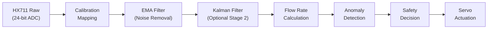

# Drip-Sense — Core Algorithms

> **Version:** 1.0  
> **Date:** 2026-02-19  
> **Scope:** Signal processing, flow computation, anomaly detection, and control algorithms

---

## 1. Algorithm Pipeline Overview



Each stage operates on the output of the previous stage, forming a deterministic processing pipeline that completes within 5 ms per sensor cycle.

---

## 2. Weight Measurement & Calibration

### 2.1 Raw ADC to Grams Conversion

The HX711 outputs a signed 24-bit integer. Conversion to physical weight uses a **two-point linear calibration** model:

```
weight_g = (raw_adc - zero_offset) / scale_factor
```

| Parameter | Source | Storage |
|---|---|---|
| `zero_offset` | Measured during tare (no load) | NVS |
| `scale_factor` | Computed from known reference weight | NVS |

### 2.2 Calibration Procedure

```
Step 1: TARE (Zero-Point Calibration)
    - Remove all load from the cell
    - Read N = 20 samples
    - zero_offset = mean(samples)

Step 2: SPAN (Known-Weight Calibration)
    - Place known weight W_ref (e.g., 500 g) on load cell
    - Read N = 20 samples
    - raw_mean = mean(samples)
    - scale_factor = (raw_mean - zero_offset) / W_ref
```

**Calibration quality check:**
- Standard deviation of tare samples must be < 50 ADC units
- If exceeded, system reports "UNSTABLE SURFACE" and requests retry

### 2.3 Temperature Drift Compensation (Future)

Load cells exhibit thermal drift (~0.02% / °C). A future enhancement will use the ESP32's internal temperature sensor to apply a correction factor:

```
weight_corrected = weight_raw × (1 + α × (T_current - T_calibration))
```

Where `α` is the temperature coefficient determined during factory calibration.

---

## 3. Digital Filtering

### 3.1 Exponential Moving Average (EMA) — Primary Filter

The EMA provides real-time noise suppression with minimal latency, ideal for the 10 Hz sampling rate.

**Formula:**

```
y[n] = α × x[n] + (1 - α) × y[n-1]
```

| Parameter | Value | Rationale |
|---|---|---|
| `α` (alpha) | 0.3 | Balance between responsiveness (~3 sample lag) and smoothing |
| Input | Calibrated weight (grams) | After offset/scale conversion |
| Output | Filtered weight (grams) | Used for flow rate calculation |

**Implementation:**

```c
typedef struct {
    float alpha;
    float last_value;
    bool  initialized;
} ema_filter_t;

void ema_init(ema_filter_t *f, float alpha) {
    f->alpha = alpha;
    f->initialized = false;
}

float ema_update(ema_filter_t *f, float new_sample) {
    if (!f->initialized) {
        f->last_value = new_sample;
        f->initialized = true;
        return new_sample;
    }
    f->last_value = f->alpha * new_sample + (1.0f - f->alpha) * f->last_value;
    return f->last_value;
}
```

**Frequency response characteristics:**

| α Value | -3 dB Cutoff (at 10 Hz) | Settling Time (to 95%) | Use Case |
|---|---|---|---|
| 0.1 | 0.17 Hz | ~29 samples (2.9s) | Very smooth, slow response |
| **0.3** | **0.55 Hz** | **~9 samples (0.9s)** | **Default — balanced** |
| 0.5 | 1.0 Hz | ~5 samples (0.5s) | Fast response, more noise |

### 3.2 Kalman Filter — Optional Second Stage

For environments with significant vibration (e.g., mobile IV carts), a 1D Kalman filter provides optimal noise rejection.

**State model:**

```
State:       x = [weight]     (scalar)
Prediction:  x̂[n|n-1] = x̂[n-1|n-1]           (constant model)
             P[n|n-1]  = P[n-1|n-1] + Q         (process noise)
Update:      K[n]      = P[n|n-1] / (P[n|n-1] + R)   (Kalman gain)
             x̂[n|n]   = x̂[n|n-1] + K[n] × (z[n] - x̂[n|n-1])
             P[n|n]    = (1 - K[n]) × P[n|n-1]
```

| Parameter | Symbol | Default | Tuning Notes |
|---|---|---|---|
| Process noise | Q | 0.01 | Increase for faster response |
| Measurement noise | R | 1.0 | Decrease for more trust in sensor |
| Initial estimate | x̂₀ | First sample | — |
| Initial covariance | P₀ | 1.0 | — |

**Implementation:**

```c
typedef struct {
    float x_est;    // State estimate
    float P;        // Estimate covariance
    float Q;        // Process noise
    float R;        // Measurement noise
    float K;        // Kalman gain
} kalman_1d_t;

void kalman_init(kalman_1d_t *kf, float Q, float R) {
    kf->Q = Q;
    kf->R = R;
    kf->P = 1.0f;
    kf->x_est = 0.0f;
}

float kalman_update(kalman_1d_t *kf, float measurement) {
    // Predict
    kf->P += kf->Q;

    // Update
    kf->K = kf->P / (kf->P + kf->R);
    kf->x_est += kf->K * (measurement - kf->x_est);
    kf->P *= (1.0f - kf->K);

    return kf->x_est;
}
```

---

## 4. Flow Rate Calculation

### 4.1 Basic Flow Rate (Δ Weight / Δ Time)

Flow rate is computed as the negative derivative of weight over time, converted to mL using fluid density.

```
flow_rate_ml_min = -(weight[n] - weight[n-k]) / (k × sample_period_s) / fluid_density × 60
```

| Parameter | Value | Notes |
|---|---|---|
| `k` | 10 samples | 1-second window at 10 Hz |
| `sample_period_s` | 0.1 s | 10 Hz |
| `fluid_density` | 1.0 g/mL | Saline/dextrose ≈ 1.0–1.05 |

**Implementation:**

```c
#define FLOW_WINDOW_SIZE  10
#define SAMPLE_PERIOD_S   0.1f
#define FLUID_DENSITY     1.0f   // g/mL (configurable for dextrose)

typedef struct {
    float    buffer[FLOW_WINDOW_SIZE];
    uint8_t  index;
    bool     full;
} flow_calc_t;

float flow_calc_update(flow_calc_t *fc, float current_weight_g) {
    uint8_t oldest_index = fc->full ? fc->index : 0;
    float oldest_weight = fc->buffer[oldest_index];
    
    fc->buffer[fc->index] = current_weight_g;
    fc->index = (fc->index + 1) % FLOW_WINDOW_SIZE;
    if (fc->index == 0) fc->full = true;
    
    if (!fc->full) return 0.0f;  // Not enough data yet
    
    float delta_weight = oldest_weight - current_weight_g;  // Positive when draining
    float delta_time_s = FLOW_WINDOW_SIZE * SAMPLE_PERIOD_S;
    float flow_g_per_s = delta_weight / delta_time_s;
    float flow_ml_per_min = (flow_g_per_s / FLUID_DENSITY) * 60.0f;
    
    return (flow_ml_per_min > 0.0f) ? flow_ml_per_min : 0.0f;
}
```

### 4.2 Time-to-Empty Estimation

```
time_to_empty_min = current_weight_g / (flow_rate_ml_min × fluid_density)
```

- Returns `INFINITY` if flow rate ≤ 0 (no flow or refilling)
- Capped at 999 minutes for display purposes
- Updated every second (every 10 samples)

### 4.3 Drip Rate Conversion

For clinical reference, flow rate is also expressed in drops/minute using the IV set's drip factor:

```
drops_per_min = flow_rate_ml_min × drip_factor
```

| IV Set Type | Drip Factor | Common Use |
|---|---|---|
| Standard (macrodrip) | 15 gtt/mL | Blood, viscous fluids |
| Standard (macrodrip) | 20 gtt/mL | General infusion |
| Microdrip | 60 gtt/mL | Pediatric, precise dosing |

---

## 5. Anomaly Detection

### 5.1 Low Fluid Detection

**Trigger:** `filtered_weight_g < LOW_FLUID_THRESHOLD_G` (default: 10 g)

```c
bool detect_low_fluid(float weight_g, float threshold_g) {
    return weight_g < threshold_g;
}
```

**Debounce:** Condition must persist for 3 consecutive samples (300 ms) to avoid false positives from vibration.

### 5.2 Free-Flow Detection

A free-flow condition occurs when the roller clamp fails or slips, causing uncontrolled rapid infusion.

**Trigger:** `flow_rate > expected_rate × FREE_FLOW_MULTIPLIER` (default: 1.5×)

```c
typedef struct {
    float expected_rate;     // Set by clinician or auto-learned
    float multiplier;        // 1.5× default
    uint8_t consecutive;     // Debounce counter
    uint8_t threshold_count; // Required consecutive detections
} freeflow_detector_t;

bool detect_free_flow(freeflow_detector_t *ff, float current_rate) {
    if (current_rate > ff->expected_rate * ff->multiplier) {
        ff->consecutive++;
    } else {
        ff->consecutive = 0;
    }
    return ff->consecutive >= ff->threshold_count;
}
```

**Auto-learning mode:** During the first 5 minutes of monitoring, the system records the median flow rate and uses it as `expected_rate`. This can be overridden by manual input.

### 5.3 Air-in-Line / Flow Stall Detection

When the IV bag empties or a kink develops, flow stops while the bag weight stabilizes.

**Trigger:** Weight stable (Δ < 0.5 g over 30 seconds) AND flow rate was previously > 0

```c
bool detect_flow_stall(float weight_g, float prev_weight_g, 
                       uint32_t stall_duration_ms, uint32_t timeout_ms) {
    float delta = fabsf(weight_g - prev_weight_g);
    if (delta < 0.5f) {
        return stall_duration_ms >= timeout_ms;
    }
    return false;
}
```

### 5.4 Detection Summary

| Anomaly | Detection Method | Debounce | Response |
|---|---|---|---|
| Low fluid | Weight < threshold | 3 samples (300 ms) | Clamp + alarm |
| Free flow | Rate > 1.5× expected | 5 samples (500 ms) | Clamp + alarm |
| Flow stall | Δweight < 0.5 g for 30s | 30s continuous | Clamp + alarm |
| Sensor fault | HX711 timeout > 1s | Immediate | Clamp + alarm + safe mode |

---

## 6. Servo Control Algorithm

### 6.1 Position Control

The servo uses a simple open-loop position command (not PID), since the SG90's internal potentiometer provides closed-loop control at the hardware level.

```c
void servo_move_to_angle(uint8_t target_angle) {
    // Map angle (0-180) to PWM duty (1000-2000 µs)
    uint32_t pulse_us = 1000 + (uint32_t)(target_angle * 1000.0f / 180.0f);
    uint32_t duty = (uint32_t)((float)pulse_us / 20000.0f * 65536.0f);
    ledc_set_duty(LEDC_HIGH_SPEED_MODE, LEDC_CHANNEL_0, duty);
    ledc_update_duty(LEDC_HIGH_SPEED_MODE, LEDC_CHANNEL_0);
}
```

### 6.2 Smooth Clamping Profile

To avoid mechanical shock on the IV tube, the servo moves in graduated steps:

```c
void servo_smooth_clamp(uint8_t start_angle, uint8_t end_angle, uint16_t total_ms) {
    int steps = abs(end_angle - start_angle);
    int step_delay = total_ms / steps;
    int direction = (end_angle > start_angle) ? 1 : -1;

    for (int angle = start_angle; angle != end_angle; angle += direction) {
        servo_move_to_angle(angle);
        vTaskDelay(pdMS_TO_TICKS(step_delay));
    }
    servo_move_to_angle(end_angle);  // Ensure final position
}
```

| Operation | Start Angle | End Angle | Duration | Notes |
|---|---|---|---|---|
| **Clamp (normal)** | 0° | 90° | 1,000 ms | Smooth ramp |
| **Clamp (emergency)** | 0° | 90° | 200 ms | Fast, direct command |
| **Release** | 90° | 0° | 500 ms | Smooth ramp |

### 6.3 Servo Power Management

After reaching the target angle, the servo signal is detached after a 2-second hold to reduce power consumption and eliminate servo jitter/buzz:

```c
void servo_clamp_and_hold(void) {
    servo_smooth_clamp(SERVO_OPEN_ANGLE, SERVO_CLAMP_ANGLE, 1000);
    vTaskDelay(pdMS_TO_TICKS(2000));  // Hold position
    servo_detach();                    // Cut PWM signal
    // Mechanical friction holds the clamp in place
}
```

---

## 7. Algorithm Configuration Summary

| Parameter | Default | Range | NVS Key |
|---|---|---|---|
| EMA alpha | 0.3 | 0.05–0.9 | `algo.ema_alpha` |
| Kalman Q (process noise) | 0.01 | 0.001–1.0 | `algo.kalman_q` |
| Kalman R (measurement noise) | 1.0 | 0.1–10.0 | `algo.kalman_r` |
| Flow window size | 10 samples | 5–50 | `algo.flow_window` |
| Low fluid threshold | 10.0 g | 5–50 g | `safety.low_threshold` |
| Free-flow multiplier | 1.5× | 1.2–3.0× | `safety.ff_multi` |
| Stall timeout | 30,000 ms | 10,000–120,000 | `safety.stall_ms` |
| Fluid density | 1.0 g/mL | 0.9–1.1 | `algo.density` |
| Clamp angle | 90° | 60–120° | `safety.clamp_angle` |
| Open angle | 0° | 0–30° | `safety.open_angle` |

---

> **Previous:** [← Firmware Design](firmware_design.md)  
> **Next:** [Cloud API & Data Format →](api_spec.md)
