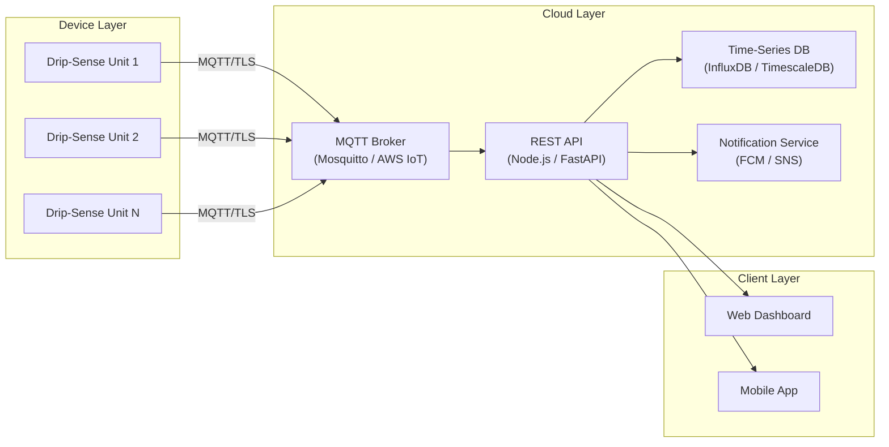

# Drip-Sense — Cloud API & Data Format

> **Version:** 1.0  
> **Date:** 2026-02-19  
> **Protocol:** MQTT 3.1.1 over TLS + REST (Dashboard)

---

## 1. Architecture Overview



---

## 2. MQTT Topic Hierarchy

All topics are prefixed with the organization namespace and follow a hierarchical structure.

```
dripsense/
├── {device_id}/
│   ├── telemetry          # Periodic sensor data (QoS 0)
│   ├── alerts             # Safety events (QoS 1)
│   ├── status             # Device status changes (QoS 1)
│   ├── config/set         # Cloud → Device: configuration push
│   ├── config/ack         # Device → Cloud: configuration acknowledgment
│   ├── ota/notify         # Cloud → Device: firmware update available
│   ├── ota/progress       # Device → Cloud: update progress
│   └── ota/result         # Device → Cloud: update result
├── ward/{ward_id}/
│   └── summary            # Aggregated ward-level summary (server-generated)
└── system/
    └── broadcast           # System-wide announcements
```

### Topic Access Control (ACL)

| Client | Subscribe | Publish |
|---|---|---|
| Device `{device_id}` | `dripsense/{device_id}/config/set`, `dripsense/{device_id}/ota/notify` | `dripsense/{device_id}/telemetry`, `dripsense/{device_id}/alerts`, `dripsense/{device_id}/status` |
| Dashboard | `dripsense/+/telemetry`, `dripsense/+/alerts`, `dripsense/+/status` | `dripsense/{device_id}/config/set`, `dripsense/{device_id}/ota/notify` |
| Admin | `dripsense/#` | `dripsense/system/broadcast` |

---

## 3. MQTT Payload Schemas

### 3.1 Telemetry Message

**Topic:** `dripsense/{device_id}/telemetry`  
**QoS:** 0 (at most once)  
**Publish interval:** Every 5 seconds  

```json
{
    "device_id": "DS-ESP32-001",
    "timestamp": "2026-02-19T09:30:00.000Z",
    "firmware_version": "1.2.0",
    "uptime_s": 86400,
    "weight_g": 487.3,
    "flow_rate_ml_min": 2.1,
    "flow_rate_drops_min": 42,
    "time_to_empty_min": 232,
    "drip_factor": 20,
    "fluid_density": 1.0,
    "battery_pct": null,
    "wifi_rssi_dbm": -52,
    "state": "MONITORING",
    "heap_free_bytes": 142560
}
```

**Field definitions:**

| Field | Type | Unit | Required | Description |
|---|---|---|---|---|
| `device_id` | string | — | ✅ | Unique device identifier |
| `timestamp` | string (ISO 8601) | — | ✅ | UTC timestamp |
| `firmware_version` | string (semver) | — | ✅ | Running firmware version |
| `uptime_s` | uint32 | seconds | ✅ | Time since boot |
| `weight_g` | float | grams | ✅ | Filtered weight reading |
| `flow_rate_ml_min` | float | mL/min | ✅ | Computed flow rate |
| `flow_rate_drops_min` | uint16 | drops/min | ❌ | Derived from flow rate × drip factor |
| `time_to_empty_min` | uint16 | minutes | ❌ | Estimated (null if no flow) |
| `drip_factor` | uint8 | gtt/mL | ❌ | IV set drip factor |
| `fluid_density` | float | g/mL | ❌ | Fluid density for conversion |
| `battery_pct` | uint8 | % | ❌ | Battery level (null if no battery) |
| `wifi_rssi_dbm` | int8 | dBm | ✅ | Wi-Fi signal strength |
| `state` | string (enum) | — | ✅ | See State Enum below |
| `heap_free_bytes` | uint32 | bytes | ❌ | Free heap memory |

**State Enum values:** `IDLE`, `CALIBRATING`, `MONITORING`, `LOW_FLUID`, `FREE_FLOW`, `AIR_DETECT`, `CLAMPED`, `ERROR`, `OTA_UPDATE`

### 3.2 Alert Message

**Topic:** `dripsense/{device_id}/alerts`  
**QoS:** 1 (at least once — delivery guaranteed)  

```json
{
    "device_id": "DS-ESP32-001",
    "timestamp": "2026-02-19T09:30:05.000Z",
    "alert_id": "a1b2c3d4-e5f6-7890-abcd-ef1234567890",
    "severity": "CRITICAL",
    "type": "LOW_FLUID",
    "message": "IV bag weight below threshold (8.2g < 10.0g). Tube clamped automatically.",
    "weight_g": 8.2,
    "flow_rate_ml_min": 2.1,
    "threshold_g": 10.0,
    "action_taken": "SERVO_CLAMP",
    "acknowledged": false
}
```

**Severity levels:**

| Severity | Usage | Dashboard Behavior |
|---|---|---|
| `INFO` | Wi-Fi reconnected, calibration complete | Log only |
| `WARNING` | Low battery, weak Wi-Fi signal | Yellow badge |
| `CRITICAL` | Low fluid, free flow, air detect | Red badge + push notification + sound |
| `EMERGENCY` | Sensor failure, system error | Red flashing + persistent notification |

### 3.3 Status Message

**Topic:** `dripsense/{device_id}/status`  
**QoS:** 1  
**Retained:** Yes (last known status persists for new subscribers)  

```json
{
    "device_id": "DS-ESP32-001",
    "timestamp": "2026-02-19T09:00:00.000Z",
    "online": true,
    "state": "MONITORING",
    "ip_address": "192.168.1.105",
    "mac_address": "AA:BB:CC:DD:EE:FF",
    "firmware_version": "1.2.0"
}
```

### 3.4 Configuration Push (Cloud → Device)

**Topic:** `dripsense/{device_id}/config/set`  

```json
{
    "request_id": "cfg-001",
    "timestamp": "2026-02-19T10:00:00.000Z",
    "config": {
        "low_threshold_g": 15.0,
        "free_flow_multiplier": 2.0,
        "mqtt_pub_interval_ms": 10000,
        "drip_factor": 15
    }
}
```

### 3.5 Configuration Acknowledgment (Device → Cloud)

**Topic:** `dripsense/{device_id}/config/ack`  

```json
{
    "request_id": "cfg-001",
    "status": "APPLIED",
    "applied_config": {
        "low_threshold_g": 15.0,
        "free_flow_multiplier": 2.0
    },
    "rejected_keys": [],
    "errors": []
}
```

---

## 4. REST API Endpoints (Dashboard Backend)

### Base URL: `https://api.dripsense.io/v1`

### 4.1 Device Management

| Method | Endpoint | Description |
|---|---|---|
| `GET` | `/devices` | List all registered devices |
| `GET` | `/devices/{device_id}` | Get device details & last status |
| `POST` | `/devices` | Register a new device |
| `DELETE` | `/devices/{device_id}` | Decommission a device |
| `PATCH` | `/devices/{device_id}/config` | Update device configuration (pushed via MQTT) |

**Example: `GET /devices/{device_id}`**

```json
{
    "device_id": "DS-ESP32-001",
    "name": "ICU Bed 3",
    "ward": "ICU-A",
    "registered_at": "2026-01-15T08:00:00.000Z",
    "last_seen": "2026-02-19T09:30:00.000Z",
    "online": true,
    "firmware_version": "1.2.0",
    "current_state": "MONITORING",
    "config": {
        "low_threshold_g": 10.0,
        "free_flow_multiplier": 1.5,
        "mqtt_pub_interval_ms": 5000,
        "drip_factor": 20
    }
}
```

### 4.2 Telemetry History

| Method | Endpoint | Description |
|---|---|---|
| `GET` | `/devices/{device_id}/telemetry` | Query telemetry history |
| `GET` | `/devices/{device_id}/telemetry/latest` | Get latest telemetry snapshot |

**Query Parameters:**

| Param | Type | Default | Description |
|---|---|---|---|
| `from` | ISO 8601 | 1 hour ago | Start timestamp |
| `to` | ISO 8601 | now | End timestamp |
| `resolution` | string | `raw` | `raw`, `1m`, `5m`, `15m`, `1h` (downsampled) |
| `limit` | int | 1000 | Max records returned |

### 4.3 Alerts

| Method | Endpoint | Description |
|---|---|---|
| `GET` | `/devices/{device_id}/alerts` | Query alert history |
| `POST` | `/alerts/{alert_id}/acknowledge` | Acknowledge an alert |
| `GET` | `/wards/{ward_id}/alerts/active` | Get active alerts for a ward |

### 4.4 Firmware Management

| Method | Endpoint | Description |
|---|---|---|
| `POST` | `/firmware/upload` | Upload new firmware binary |
| `GET` | `/firmware/versions` | List available firmware versions |
| `POST` | `/devices/{device_id}/ota/trigger` | Trigger OTA update for a device |
| `POST` | `/wards/{ward_id}/ota/trigger` | Batch OTA for entire ward |

---

## 5. Authentication & Security

| Mechanism | Scope | Details |
|---|---|---|
| **X.509 Client Certificates** | Device → MQTT Broker | Each device has a unique cert provisioned during setup |
| **API Keys** | Dashboard → REST API | Bearer token in `Authorization` header |
| **JWT** | User sessions | Issued on login, 1-hour expiry, refresh token rotation |
| **TLS 1.2+** | All connections | Required for MQTT (8883) and HTTPS (443) |
| **Rate Limiting** | REST API | 100 req/min per API key; 1000 req/min per IP |

---

## 6. Error Codes

| Code | HTTP Status | Description |
|---|---|---|
| `DEVICE_NOT_FOUND` | 404 | Device ID not registered |
| `DEVICE_OFFLINE` | 503 | Device not connected to MQTT broker |
| `INVALID_CONFIG` | 400 | Configuration value out of valid range |
| `AUTH_FAILED` | 401 | Invalid or expired credentials |
| `RATE_LIMITED` | 429 | Too many requests |
| `OTA_IN_PROGRESS` | 409 | Device is already performing an OTA update |
| `FIRMWARE_NOT_FOUND` | 404 | Requested firmware version doesn't exist |
| `INTERNAL_ERROR` | 500 | Unexpected server error |

---

## 7. Data Retention Policy

| Data Type | Retention | Storage |
|---|---|---|
| Raw telemetry (5s interval) | 7 days | Time-series DB |
| Downsampled telemetry (1 min) | 90 days | Time-series DB |
| Downsampled telemetry (1 hour) | 2 years | Time-series DB |
| Alert history | 2 years | Relational DB |
| Device configuration history | Indefinite | Relational DB |
| Firmware binaries | Indefinite | Object storage (S3) |

---

> **Previous:** [← Core Algorithms](algorithms.md)  
> **Next:** [Calibration & Setup Guide →](calibration.md)
