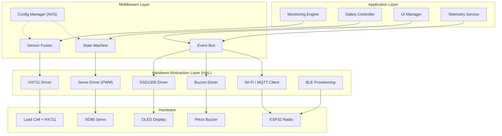
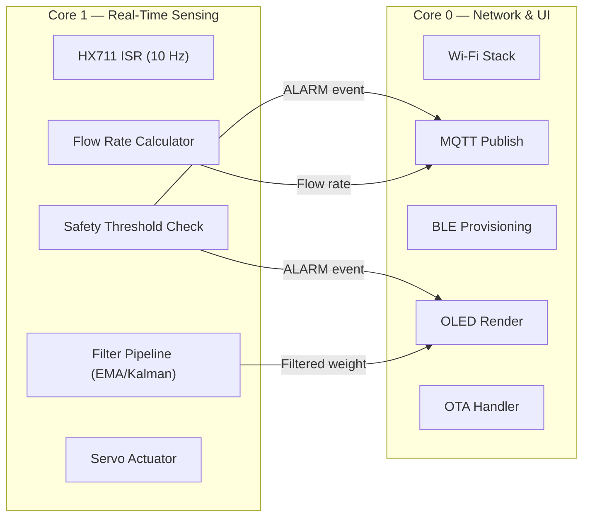
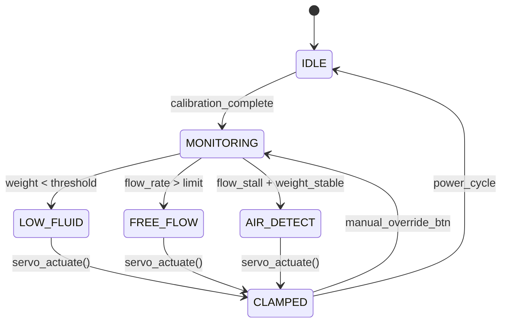
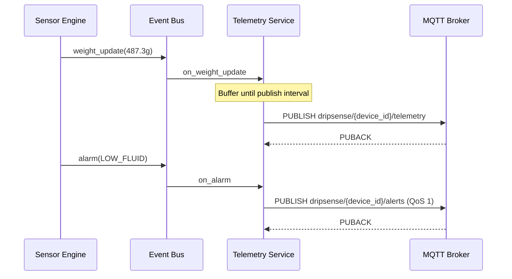
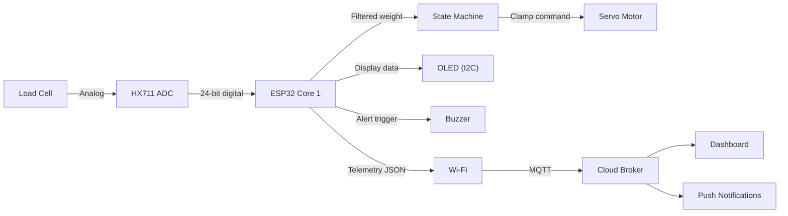

# Drip-Sense — Software Architecture

> **Version:** 1.0  
> **Date:** 2026-02-19  
> **Status:** Draft

---

## 1. Architecture Overview

Drip-Sense follows a **layered embedded architecture** that separates hardware concerns from application logic. The system runs on a single ESP32 SoC, using its dual-core capability to partition real-time sensor tasks from network communication.



---

## 2. Core Design Principles

| Principle | Application |
|---|---|
| **Separation of concerns** | HAL isolates GPIO/peripheral details; application layer contains only domain logic |
| **Event-driven** | Modules communicate via an event bus rather than direct coupling |
| **Fail-safe default** | Servo clamps the tube on any unrecoverable error (fail-closed) |
| **Deterministic timing** | Sensor sampling runs on Core 1 with fixed-interval timer ISR |
| **Graceful degradation** | System continues monitoring locally if Wi-Fi drops (BLE fallback) |

---

## 3. Dual-Core Task Allocation

The ESP32's two cores are assigned distinct responsibilities to prevent network operations from blocking safety-critical sensor processing.



| Core | Task | Period | Stack Size |
|---|---|---|---|
| Core 1 | `task_sensor_read` | 100 ms (10 Hz) | 4 KB |
| Core 1 | `task_safety_check` | 100 ms | 2 KB |
| Core 0 | `task_mqtt_publish` | 5,000 ms | 8 KB |
| Core 0 | `task_oled_update` | 500 ms | 4 KB |
| Core 0 | `task_ble_provision` | On-demand | 4 KB |
| Core 0 | `task_ota_update` | On-demand | 8 KB |

---

## 4. Module Decomposition

### 4.1 Monitoring Engine

**Responsibility:** Orchestrates the sensor → filter → compute pipeline.

```
┌─────────────┐     ┌──────────────┐     ┌─────────────────┐     ┌──────────────┐
│  HX711 Read │────▶│  EMA Filter  │────▶│  Flow Rate Calc │────▶│  Event Bus   │
│  (raw ADC)  │     │  (smoothing) │     │  (mL/min)       │     │  (publish)   │
└─────────────┘     └──────────────┘     └─────────────────┘     └──────────────┘
```

- **Input:** Raw 24-bit ADC values from HX711 at 10 Hz
- **Processing:** EMA filter (α = 0.3), conversion to grams via calibration coefficients
- **Output:** `weight_g`, `flow_rate_ml_min`, `time_to_empty_min`

### 4.2 Safety Controller

**Responsibility:** Evaluates safety conditions and triggers servo clamp.



**Safety thresholds (configurable via NVS):**

| Parameter | Default | Range |
|---|---|---|
| `LOW_FLUID_THRESHOLD_G` | 10 g | 5–50 g |
| `FREE_FLOW_MULTIPLIER` | 1.5× | 1.2–3.0× |
| `FLOW_STALL_TIMEOUT_MS` | 30,000 ms | 10,000–120,000 ms |
| `SERVO_CLAMP_ANGLE` | 90° | 60–120° |
| `SERVO_OPEN_ANGLE` | 0° | 0–30° |

### 4.3 UI Manager

**Responsibility:** Drives the 128×64 OLED display and piezo buzzer.

**Display layout (4 zones):**

```
┌────────────────────────────────┐
│  STATUS BAR  [WiFi] [Battery]  │  ← 12px: icons
├────────────────────────────────┤
│   Weight:  487.3 g             │  ← 20px: primary metric
│   Flow:    2.1 mL/min          │  ← 20px: secondary metric
├────────────────────────────────┤
│   ETA: 3h 42m remaining       │  ← 12px: tertiary info
└────────────────────────────────┘
```

**Buzzer patterns:**

| Event | Pattern | Duration |
|---|---|---|
| Calibration complete | ●● (double beep) | 200 ms |
| Low fluid warning | ●—●—●— (intermittent) | Until acknowledged |
| Emergency clamp | ●●●●●● (continuous) | Until manual override |
| Wi-Fi connected | ● (single beep) | 100 ms |

### 4.4 Telemetry Service

**Responsibility:** Publishes device telemetry to the cloud via MQTT.



### 4.5 Config Manager (NVS)

**Responsibility:** Persists configuration across reboots using ESP32 Non-Volatile Storage.

**Stored parameters:**

| Namespace | Key | Type | Description |
|---|---|---|---|
| `cal` | `zero_offset` | int32 | Load cell zero-point raw ADC value |
| `cal` | `scale_factor` | float | Grams-per-ADC-unit conversion factor |
| `net` | `wifi_ssid` | string | Hospital Wi-Fi SSID |
| `net` | `wifi_pass` | string | Wi-Fi password (encrypted) |
| `net` | `mqtt_broker` | string | MQTT broker URL |
| `dev` | `device_id` | string | Unique device identifier |
| `safety` | `low_threshold` | float | Low-fluid weight threshold (g) |
| `safety` | `clamp_angle` | int | Servo clamp angle (degrees) |

---

## 5. Data Flow Architecture



### Data Pipeline Timing

```
t=0ms    HX711 DOUT goes low (data ready)
t=0.1ms  ISR triggers, reads 24-bit value (~25 clock pulses)
t=1ms    EMA filter applied, weight_g computed
t=2ms    Flow rate updated (Δweight / Δtime)
t=3ms    Safety thresholds evaluated
t=5ms    Event bus notified (weight_update event)
t=100ms  OLED refreshed (next frame)
t=5000ms MQTT telemetry published
```

---

## 6. Memory Architecture

### 6.1 Flash Layout (4 MB)

| Partition | Offset | Size | Purpose |
|---|---|---|---|
| `nvs` | 0x9000 | 24 KB | Non-volatile storage (calibration, config) |
| `otadata` | 0xF000 | 8 KB | OTA boot selection |
| `app0` | 0x10000 | 1.5 MB | Active firmware image |
| `app1` | 0x190000 | 1.5 MB | OTA update staging area |
| `spiffs` | 0x310000 | 960 KB | Event logs, crash dumps |

### 6.2 RAM Budget (520 KB SRAM)

| Allocation | Size | Notes |
|---|---|---|
| FreeRTOS kernel + stacks | ~80 KB | 6 tasks × avg 4 KB + kernel overhead |
| Wi-Fi / TCP/IP stack | ~70 KB | ESP-IDF managed |
| MQTT client buffers | ~16 KB | 2× 8 KB pub/sub buffers |
| OLED frame buffer | ~1 KB | 128×64 / 8 = 1,024 bytes |
| Sensor ring buffer | ~4 KB | 1,000 samples × 4 bytes |
| Application heap | ~100 KB | JSON serialization, string ops |
| **Reserved / free** | **~249 KB** | Safety margin |

---

## 7. Communication Protocols

### 7.1 On-Device Protocols

| Protocol | Bus | Speed | Usage |
|---|---|---|---|
| Bit-bang SPI | GPIO 18/19 | ~1 MHz | HX711 ADC communication |
| I2C | GPIO 21/22 | 400 kHz | SSD1306 OLED display |
| PWM | GPIO 13 | 50 Hz | SG90 servo control |
| Digital I/O | GPIO 15 | — | Buzzer ON/OFF |
| Digital I/O | GPIO 4 | — | Manual override button (pull-up, debounced) |

### 7.2 Network Protocols

| Protocol | Transport | QoS | Usage |
|---|---|---|---|
| MQTT 3.1.1 | TCP/TLS (port 8883) | 0 (telemetry), 1 (alerts) | Cloud telemetry |
| HTTP/S | TCP (port 443) | — | OTA firmware download |
| BLE GATT | — | — | Wi-Fi provisioning, local diagnostics |

---

## 8. Error Handling Strategy

| Error Class | Detection | Response | Recovery |
|---|---|---|---|
| **Sensor failure** | HX711 timeout (no DOUT low for >1s) | Clamp tube, sound alarm | Retry 3×, then enter safe mode |
| **Wi-Fi disconnect** | MQTT keepalive timeout | Switch to BLE beacon mode | Auto-reconnect with exponential backoff |
| **Servo stall** | Current draw > threshold (future upgrade) | Sound alarm, log event | Manual intervention required |
| **Heap exhaustion** | `heap_caps_get_free_size()` < 20 KB | Disable non-critical tasks | Restart via watchdog |
| **Firmware crash** | Hardware watchdog timer (5s) | Automatic reset | Boot to last-known-good OTA partition |
| **NVS corruption** | CRC check failure on read | Use compiled defaults | Re-calibration required |

---

## 9. Security Architecture

| Layer | Mechanism |
|---|---|
| **Transport** | TLS 1.2 for MQTT; certificate pinning |
| **Authentication** | Device certificate (X.509) or pre-shared key |
| **OTA integrity** | SHA-256 firmware signature verification |
| **Local access** | BLE pairing with passkey |
| **Credential storage** | Wi-Fi password encrypted in NVS |
| **Debug access** | Serial console disabled in production builds |

---

> **Previous:** [← Product Requirements](prd.md)  
> **Next:** [Firmware Design →](firmware_design.md)
