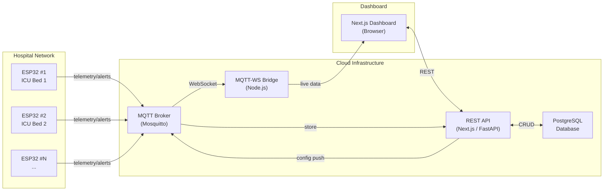
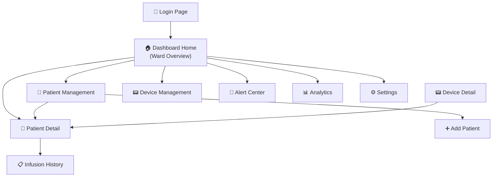
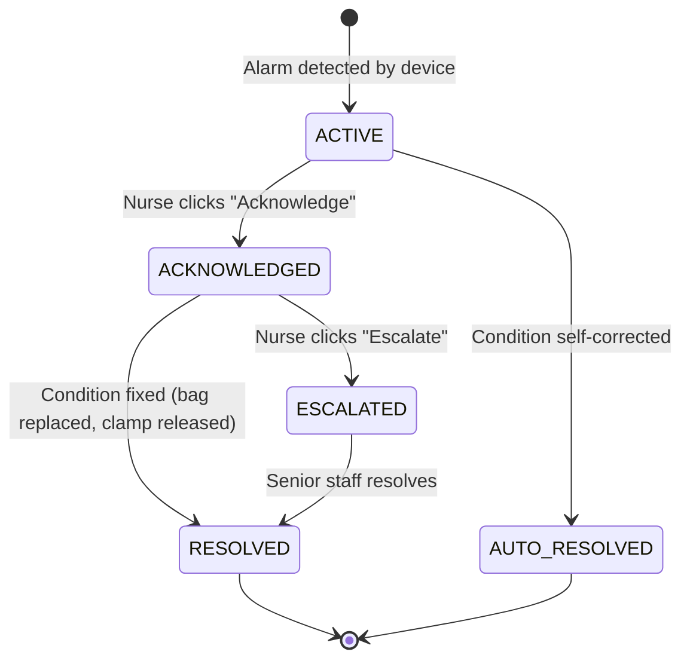
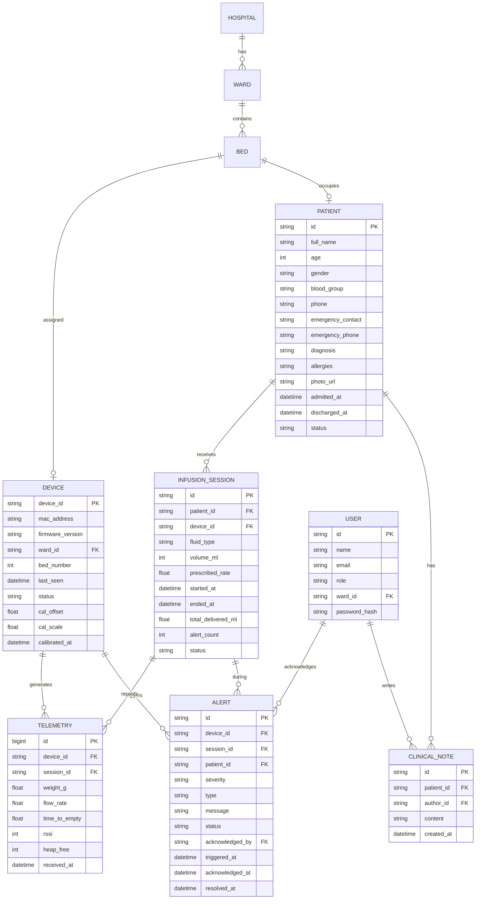
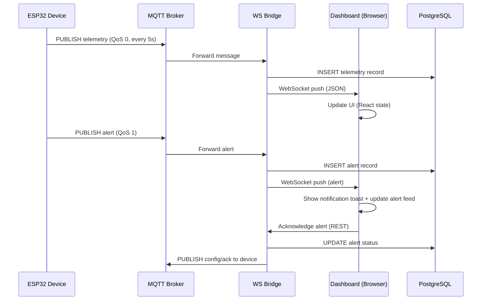
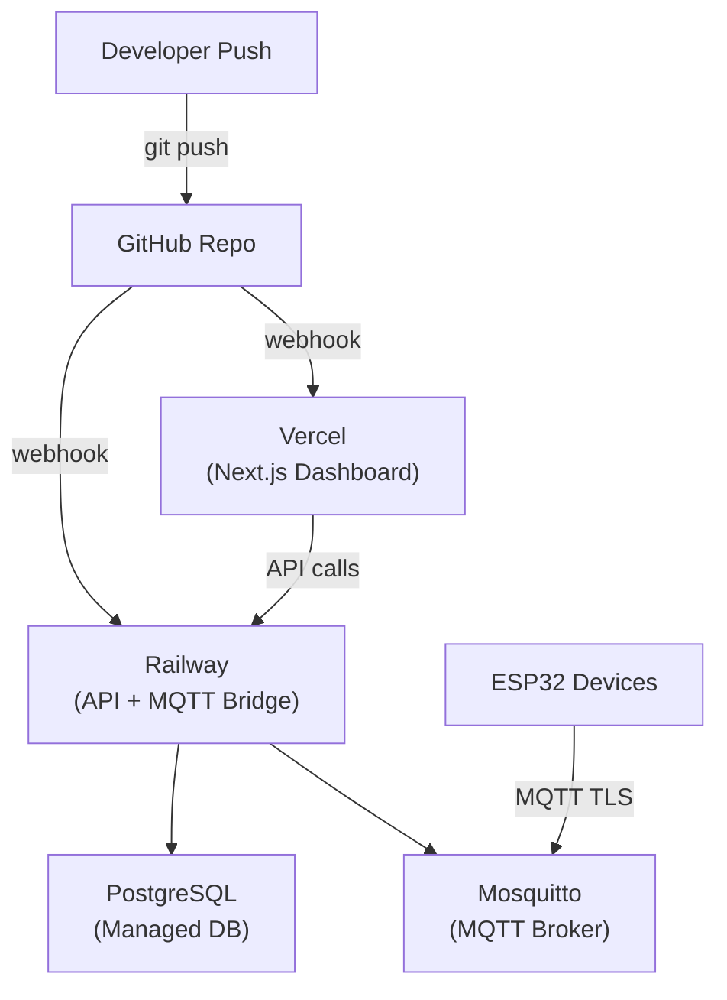

# Drip-Sense — Dashboard Control Center Design

> **Version:** 1.0  
> **Date:** 2026-02-19  
> **Status:** Design Phase  
> **Audience:** Frontend developers, UI/UX designers, hospital IT, project stakeholders

---

## 1. Executive Summary

The Drip-Sense Dashboard is a **real-time web-based control center** for monitoring all IV drip devices deployed across a hospital. It provides nurses, doctors, and hospital administrators with a single pane of glass to:

- View every active IV session in real time
- Receive and manage alerts
- Track patient infusion history
- Manually enter and manage patient data
- Analyze trends via interactive charts
- Remotely configure and update devices

```
┌──────────────────────────────────────────────────────────┐
│                  DRIP-SENSE DASHBOARD                    │
│                                                          │
│  ┌────────┐  ┌────────────────────────────────────────┐  │
│  │  Side  │  │                                        │  │
│  │  Nav   │  │          Main Content Area              │  │
│  │        │  │                                        │  │
│  │  🏠    │  │   Live ward overview, patient cards,    │  │
│  │  👥    │  │   charts, alerts, device management     │  │
│  │  📊    │  │                                        │  │
│  │  🔔    │  │                                        │  │
│  │  ⚙️    │  │                                        │  │
│  └────────┘  └────────────────────────────────────────┘  │
│  ┌────────────────────────────────────────────────────┐  │
│  │             Status Bar / Notifications             │  │
│  └────────────────────────────────────────────────────┘  │
└──────────────────────────────────────────────────────────┘
```

---

## 2. Tech Stack

### 2.1 Recommended Stack

| Layer | Technology | Why |
|---|---|---|
| **Frontend Framework** | **Next.js 14** (React) | Server-side rendering, file-based routing, API routes built-in |
| **UI Component Library** | **shadcn/ui** + **Radix Primitives** | Modern, accessible, customizable — perfect for dashboards |
| **Styling** | **Tailwind CSS 3** | Utility-first, dark mode support, rapid prototyping |
| **Charts & Visualization** | **Recharts** + **Tremor** | React-native charting with beautiful defaults |
| **Real-Time Data** | **Socket.IO** or **MQTT.js** (WebSocket) | Live telemetry push from MQTT broker |
| **State Management** | **Zustand** | Lightweight, no boilerplate, perfect for device state |
| **Data Tables** | **TanStack Table v8** | Sorting, filtering, pagination for patient records |
| **Date/Time** | **date-fns** | Lightweight date formatting and manipulation |
| **Icons** | **Lucide React** | 1,000+ clean icons, tree-shakable |
| **Notifications** | **Sonner** (toast) + **Push API** | In-app + browser push notifications |
| **Authentication** | **NextAuth.js** | Role-based auth (admin, nurse, doctor) |
| **Backend API** | **Next.js API Routes** or **FastAPI** (Python) | REST endpoints for CRUD operations |
| **Database** | **PostgreSQL** + **Prisma ORM** | Relational data for patients, sessions, alerts |
| **Real-Time Broker** | **Eclipse Mosquitto** (MQTT) | Receives telemetry from ESP32 devices |
| **Deployment** | **Vercel** (frontend) + **Railway/Docker** (backend) | Managed hosting, auto-deploy on push |

### 2.2 Architecture Diagram



### 2.3 Alternative Lightweight Stack

For a simpler MVP (no backend server):

| Layer | Technology |
|---|---|
| Frontend | **Vite + React** |
| Styling | **Tailwind CSS** |
| Charts | **Chart.js** |
| Real-Time | **MQTT.js** (direct browser → broker via WebSocket) |
| Storage | **localStorage** or **IndexedDB** (browser-only) |
| Deployment | **GitHub Pages** or **Netlify** |

---

## 3. Design System

### 3.1 Color Palette

```
┌──────────────────────────────────────────────────────────┐
│  DRIP-SENSE DASHBOARD — COLOR SYSTEM                     │
│                                                          │
│  Primary       ██████  #6366F1  Indigo-500 (brand)       │
│  Primary Hover ██████  #4F46E5  Indigo-600               │
│  Accent        ██████  #06B6D4  Cyan-500 (data highlight)│
│                                                          │
│  Success       ██████  #22C55E  Green-500 (normal)       │
│  Warning       ██████  #F59E0B  Amber-500 (low fluid)    │
│  Danger        ██████  #EF4444  Red-500 (critical alarm)  │
│  Info          ██████  #3B82F6  Blue-500 (informational)  │
│                                                          │
│  ── Dark Theme (Default) ──                              │
│  Background    ██████  #0F172A  Slate-900                │
│  Surface       ██████  #1E293B  Slate-800                │
│  Card          ██████  #334155  Slate-700                │
│  Border        ██████  #475569  Slate-600                │
│  Text Primary  ██████  #F8FAFC  Slate-50                 │
│  Text Muted    ██████  #94A3B8  Slate-400                │
│                                                          │
│  ── Light Theme ──                                       │
│  Background    ██████  #F8FAFC  Slate-50                 │
│  Surface       ██████  #FFFFFF  White                    │
│  Card          ██████  #F1F5F9  Slate-100                │
│  Text Primary  ██████  #0F172A  Slate-900                │
└──────────────────────────────────────────────────────────┘
```

### 3.2 Typography

| Element | Font | Weight | Size |
|---|---|---|---|
| Dashboard title | **Inter** | 700 (Bold) | 24px |
| Page headers | **Inter** | 600 (Semi) | 20px |
| Card titles | **Inter** | 600 | 16px |
| Body text | **Inter** | 400 | 14px |
| Small / labels | **Inter** | 500 | 12px |
| Monospace (data) | **JetBrains Mono** | 400 | 14px |

### 3.3 Component Styling

| Component | Style |
|---|---|
| Cards | `bg-slate-800/60`, `backdrop-blur-xl`, `border border-slate-700/50`, `rounded-xl` |
| Buttons (primary) | `bg-indigo-500 hover:bg-indigo-600`, `rounded-lg`, `shadow-lg shadow-indigo-500/25` |
| Buttons (danger) | `bg-red-500/20 text-red-400 border-red-500/30` |
| Input fields | `bg-slate-900 border-slate-700 focus:ring-indigo-500` |
| Badges | Pill-shaped with color-coded backgrounds |
| Charts | Gradient area fills, smooth animations, tooltip on hover |
| Transitions | `transition-all duration-300 ease-out` on all interactive elements |

### 3.4 Micro-Animations

| Element | Animation |
|---|---|
| Card hover | Subtle `scale(1.02)` + shadow increase |
| Alert pulse | Red glow pulse (`animate-pulse`) on critical alerts |
| Live data dot | Green blinking dot next to "LIVE" badge |
| Chart update | Smooth line animation on new data point |
| Sidebar nav | Slide-in highlight on active item |
| Notifications | Slide-in from top-right with fade |
| Loading | Skeleton shimmer on cards during data fetch |
| Page transitions | Fade + slide-up on route change |

---

## 4. Dashboard Pages

### 4.1 Page Map



---

### 4.2 Page 1: Dashboard Home (Ward Overview)

**URL:** `/dashboard`  
**Purpose:** Bird's-eye view of all active IV sessions across the hospital.

```
┌──────────────────────────────────────────────────────────────────────┐
│ 🩺 Drip-Sense Control Center             🔔 3  👤 Dr. Sharma  🌙   │
├───────┬──────────────────────────────────────────────────────────────┤
│       │                                                              │
│  🏠   │  ┌─────────────┐ ┌─────────────┐ ┌─────────────┐ ┌───────┐ │
│ Home  │  │ 📟 Active   │ │ 🟢 Normal   │ │ 🔴 Critical │ │ 📊 Avg│ │
│       │  │    12       │ │     9       │ │     2       │ │ Flow  │ │
│  👥   │  │  Devices    │ │  Devices    │ │   Alerts    │ │ 3.2   │ │
│Patients│ └─────────────┘ └─────────────┘ └─────────────┘ └───────┘ │
│       │                                                              │
│  📟   │  ── WARD: ICU-A ────────────────────────────────────────── │
│Devices│  ┌────────────────┐ ┌────────────────┐ ┌────────────────┐  │
│       │  │ 🟢 Bed 1       │ │ 🟡 Bed 2       │ │ 🔴 Bed 3       │  │
│  🔔   │  │ Raj Kumar      │ │ Priya Singh    │ │ Amit Verma     │  │
│Alerts │  │ ██████████░░ 72%│ │ ████░░░░░░ 35% │ │ █░░░░░░░░░  8% │  │
│       │  │ 2.3 mL/min     │ │ 1.8 mL/min     │ │ ⚠️ LOW FLUID   │  │
│  📊   │  │ ETA: 4h 20m    │ │ ETA: 1h 45m    │ │ 🔒 CLAMPED     │  │
│Charts │  └────────────────┘ └────────────────┘ └────────────────┘  │
│       │                                                              │
│  ⚙️   │  ── WARD: General-B ──────────────────────────────────── │
│Settings│ ┌────────────────┐ ┌────────────────┐ ┌────────────────┐  │
│       │  │ 🟢 Bed 7       │ │ 🟢 Bed 8       │ │ ⚫ Bed 9       │  │
│       │  │ Sneha Patel    │ │ Karan Mehta    │ │ (Unassigned)   │  │
│       │  │ ██████████░ 85% │ │ ██████░░░░ 55% │ │    Offline     │  │
│       │  │ 3.0 mL/min     │ │ 2.5 mL/min     │ │                │  │
│       │  └────────────────┘ └────────────────┘ └────────────────┘  │
│       │                                                              │
│       │  ── LIVE ALERT FEED ──────────────────────────────────── │
│       │  🔴 10:42 AM  Bed 3 — LOW FLUID — Auto-clamped           │
│       │  🟡 10:38 AM  Bed 2 — Fluid below 40%                   │
│       │  🟢 10:30 AM  Bed 7 — New bag started (1000 mL saline)   │
│       │  🟢 10:15 AM  Bed 1 — Device online, calibration OK      │
└───────┴──────────────────────────────────────────────────────────────┘
```

**Features:**
- **KPI Summary Cards:** Active devices, normal count, alerts, average flow
- **Ward Sections:** Grouped by ward, each bed is a card
- **Bed Cards:** Patient name, fluid level bar, flow rate, ETA, status color
- **Live Alert Feed:** Scrolling chronological alerts at the bottom
- **Auto-Refresh:** Data updates every 3 seconds via WebSocket
- **Click any bed card → Patient Detail page**

---

### 4.3 Page 2: Patient Management

**URL:** `/patients`  
**Purpose:** Full patient database with search, filter, and manual entry.

```
┌──────────────────────────────────────────────────────────────────┐
│  👥 Patient Management                    [+ Add New Patient]    │
├──────────────────────────────────────────────────────────────────┤
│  🔍 Search patients...    Ward: [All ▼]  Status: [All ▼]        │
├──────────────────────────────────────────────────────────────────┤
│                                                                  │
│  ┌─────────────────────────────────────────────────────────────┐ │
│  │ ID   │ Name          │ Age │ Ward    │ Bed │ IV Status │ ⋯ │ │
│  ├──────┼───────────────┼─────┼─────────┼─────┼───────────┼───┤ │
│  │ P001 │ Raj Kumar     │ 45  │ ICU-A   │  1  │ 🟢 Active │ → │ │
│  │ P002 │ Priya Singh   │ 32  │ ICU-A   │  2  │ 🟡 Low    │ → │ │
│  │ P003 │ Amit Verma    │ 58  │ ICU-A   │  3  │ 🔴 Clamped│ → │ │
│  │ P004 │ Sneha Patel   │ 27  │ Gen-B   │  7  │ 🟢 Active │ → │ │
│  │ P005 │ Karan Mehta   │ 63  │ Gen-B   │  8  │ 🟢 Active │ → │ │
│  │ P006 │ Meera Gupta   │ 41  │ Gen-B   │ 10  │ ⚫ Done   │ → │ │
│  └──────┴───────────────┴─────┴─────────┴─────┴───────────┴───┘ │
│                                                                  │
│  Showing 1–6 of 24 patients      [← Prev]  1  2  3  4  [Next →]│
└──────────────────────────────────────────────────────────────────┘
```

#### Add New Patient Form (Modal)

```
┌────────────────────────────────────────────────────────┐
│  ➕ Register New Patient                          ✕   │
├────────────────────────────────────────────────────────┤
│                                                        │
│  Patient ID:    [ Auto-generated: P007          ]      │
│  Full Name:     [ ________________________________ ]   │
│  Age:           [ ____ ]    Gender: [Male ▼]           │
│  Blood Group:   [ O+ ▼ ]                              │
│  Contact Phone: [ ________________________________ ]   │
│  Emergency Contact: [ ____________________________ ]   │
│                                                        │
│  ── Admission Details ──                               │
│  Ward:          [ ICU-A ▼ ]   Bed Number: [ __ ]       │
│  Admitting Doctor: [ Dr. _________________________ ]   │
│  Admission Date:   [ 2026-02-19 ]                      │
│  Diagnosis:     [ ________________________________ ]   │
│                                                        │
│  ── IV Prescription ──                                 │
│  Fluid Type:    [ Normal Saline 0.9% ▼ ]               │
│  Volume:        [ 1000 ] mL                            │
│  Prescribed Rate: [ 2.5 ] mL/min                       │
│  Start Time:    [ 12:00 ▼ ]                            │
│  Device ID:     [ DS-ESP32-001 ▼ ] (auto-link)         │
│  Notes:         [ ________________________________ ]   │
│                                                        │
│                    [ Cancel ]  [ 💾 Save Patient ]     │
└────────────────────────────────────────────────────────┘
```

**Patient data fields stored in database:**

| Field Group | Fields |
|---|---|
| **Identity** | Patient ID, full name, age, gender, blood group, photo (optional) |
| **Contact** | Phone, emergency contact name + phone, address |
| **Admission** | Admission date, ward, bed number, admitting doctor, diagnosis, allergies |
| **IV Prescription** | Fluid type, volume, prescribed rate (mL/min), drip factor (gtt/mL), additives, start time |
| **Device Link** | Device ID (auto-populated when device is assigned to a bed) |
| **Notes** | Free-text clinical notes (timestamped entries) |
| **History** | Array of past infusion sessions |

---

### 4.4 Page 3: Patient Detail

**URL:** `/patients/[patientId]`  
**Purpose:** Everything about one patient — live monitoring, history, and clinical notes.

```
┌──────────────────────────────────────────────────────────────────────┐
│  ← Back    👤 Raj Kumar (P001)         Ward: ICU-A  │  Bed: 1      │
├──────────────────────────────────────────────────────────────────────┤
│                                                                      │
│  ┌──────── Patient Info ────────┐  ┌──────── Current IV ──────────┐ │
│  │ Age: 45 │ Gender: Male       │  │ Fluid: Normal Saline 0.9%   │ │
│  │ Blood: O+ │ Doctor: Dr. Rao  │  │ Volume: 1000 mL             │ │
│  │ Diagnosis: Post-surgical     │  │ Prescribed: 2.5 mL/min      │ │
│  │ Admitted: 2026-02-17         │  │ Device: DS-ESP32-001         │ │
│  │ Allergies: Penicillin        │  │ Started: Today, 08:30 AM     │ │
│  └──────────────────────────────┘  └──────────────────────────────┘ │
│                                                                      │
│  ┌──── LIVE TELEMETRY ──────────────────────────────────────────┐   │
│  │                                                              │   │
│  │  ┌──────────┐  ┌──────────┐  ┌──────────┐  ┌──────────┐    │   │
│  │  │ Weight   │  │ Flow     │  │ ETA      │  │ Status   │    │   │
│  │  │ 487.3 g  │  │ 2.3      │  │ 3h 32m   │  │ 🟢       │    │   │
│  │  │          │  │ mL/min   │  │          │  │ Normal   │    │   │
│  │  └──────────┘  └──────────┘  └──────────┘  └──────────┘    │   │
│  │                                                              │   │
│  │  ── Weight Over Time (last 6 hours) ──                      │   │
│  │  1000 ┤                                                      │   │
│  │   800 ┤╲                                                     │   │
│  │   600 ┤  ╲                                                   │   │
│  │   400 ┤    ╲___________                                      │   │
│  │   200 ┤                ╲_____                                │   │
│  │     0 ┤──────────────────────── ← LOW threshold              │   │
│  │       └──┬───┬───┬───┬───┬───                               │   │
│  │       08:30 09:30 10:30 11:30 12:30                          │   │
│  │                                                              │   │
│  │  ── Flow Rate Over Time ──                                  │   │
│  │  5.0 ┤                                                      │   │
│  │  2.5 ┤───────────────────────── ← Prescribed rate           │   │
│  │  0.0 ┤                                                      │   │
│  │       └──┬───┬───┬───┬───┬───                               │   │
│  └──────────────────────────────────────────────────────────────┘   │
│                                                                      │
│  ┌──── INFUSION HISTORY ────────────────────────────────────────┐   │
│  │                                                              │   │
│  │  #  │ Date       │ Fluid         │ Volume │ Duration │ Alert│   │
│  │  3  │ Today      │ NS 0.9%       │ 1000mL │ ongoing  │ 0   │   │
│  │  2  │ 2026-02-18 │ D5W           │  500mL │ 3h 10m   │ 1   │   │
│  │  1  │ 2026-02-17 │ RL            │ 1000mL │ 6h 45m   │ 0   │   │
│  │                                                              │   │
│  └──────────────────────────────────────────────────────────────┘   │
│                                                                      │
│  ┌──── CLINICAL NOTES ──────────────────────────────────────────┐   │
│  │                                                              │   │
│  │  [+ Add Note]                                                │   │
│  │                                                              │   │
│  │  12:40 PM — Dr. Rao                                         │   │
│  │  Patient vitals stable. Continue NS at 2.5 mL/min.          │   │
│  │                                                              │   │
│  │  08:35 AM — Nurse Anita                                     │   │
│  │  New saline bag hung. Calibration verified. Device online.   │   │
│  │                                                              │   │
│  │  Yesterday 06:00 PM — Dr. Rao                              │   │
│  │  Post-op recovery. Start IV fluids tomorrow AM.             │   │
│  └──────────────────────────────────────────────────────────────┘   │
└──────────────────────────────────────────────────────────────────────┘
```

**Charts (Recharts):**

| Chart | Type | Data Source | Purpose |
|---|---|---|---|
| Weight vs Time | Area chart (gradient fill) | Live telemetry stream | Visualize bag drainage |
| Flow Rate vs Time | Line chart with reference line | Live telemetry | Verify flow matches prescription |
| Alert Timeline | Scatter/event markers | Alert records | Show when anomalies occurred |
| Infusion Volume Consumed | Donut chart | Current session | % of prescribed volume delivered |

---

### 4.5 Page 4: Alert Center

**URL:** `/alerts`  
**Purpose:** Centralized alarm management — acknowledge, resolve, escalate.

```
┌──────────────────────────────────────────────────────────────────┐
│  🔔 Alert Center                Active: 3  │  Today: 17         │
├──────────────────────────────────────────────────────────────────┤
│  Filter: [All Severities ▼] [All Wards ▼] [Today ▼]             │
├──────────────────────────────────────────────────────────────────┤
│                                                                  │
│  ── ACTIVE ALERTS (Unacknowledged) ─────────────────────────── │
│                                                                  │
│  🔴 CRITICAL │ 10:42 AM │ Bed 3 — LOW FLUID                     │
│     Amit Verma │ Weight: 8.2g │ Auto-clamped │ DS-ESP32-003     │
│     [✓ Acknowledge]  [📋 View Patient]  [📞 Escalate]          │
│                                                                  │
│  🔴 CRITICAL │ 10:38 AM │ Bed 12 — FREE FLOW                    │
│     Ritu Sharma │ Rate: 15.7 mL/min │ Auto-clamped              │
│     [✓ Acknowledge]  [📋 View Patient]  [📞 Escalate]          │
│                                                                  │
│  🟡 WARNING │ 10:35 AM │ Bed 2 — LOW FLUID WARNING               │
│     Priya Singh │ Weight: 45g (below 30%) │ Not clamped yet      │
│     [✓ Acknowledge]  [📋 View Patient]                          │
│                                                                  │
│  ── ACKNOWLEDGED (Resolved) ──────────────────────────────── │
│                                                                  │
│  🟢 10:15 AM │ Bed 1 — Device online │ Auto-resolved             │
│  🟢 09:50 AM │ Bed 7 — Flow stall │ Acknowledged by Nurse Reema  │
│  🟡 09:30 AM │ Bed 8 — Wi-Fi dropout │ Auto-reconnected          │
│                                                                  │
└──────────────────────────────────────────────────────────────────┘
```

**Alert Workflow:**



---

### 4.6 Page 5: Analytics & Reports

**URL:** `/analytics`  
**Purpose:** Historical analysis, trends, ward-level statistics, and exportable reports.

```
┌──────────────────────────────────────────────────────────────────┐
│  📊 Analytics & Reports            Period: [Last 7 Days ▼]       │
├──────────────────────────────────────────────────────────────────┤
│                                                                  │
│  ┌─────────────┐ ┌─────────────┐ ┌─────────────┐ ┌────────────┐│
│  │Total Sessions│ │ Avg Duration│ │ Total Alerts│ │  Fluid     ││
│  │     47       │ │   4h 35m    │ │     12      │ │  Consumed  ││
│  │ ↑ 12% vs    │ │ ↓ 8% vs    │ │ ↓ 25% vs   │ │  38.5 L    ││
│  │  last week  │ │  last week  │ │  last week  │ │            ││
│  └─────────────┘ └─────────────┘ └─────────────┘ └────────────┘│
│                                                                  │
│  ── Alerts Per Day (Bar Chart) ──                               │
│  ┌──────────────────────────────────────────────────────┐       │
│  │  5 ┤  █                                              │       │
│  │  4 ┤  █  █                                           │       │
│  │  3 ┤  █  █     █                                     │       │
│  │  2 ┤  █  █  █  █  █     █                            │       │
│  │  1 ┤  █  █  █  █  █  █  █                            │       │
│  │    └──Mo─Tu─We─Th─Fr─Sa─Su──                        │       │
│  └──────────────────────────────────────────────────────┘       │
│                                                                  │
│  ── Fluid Usage by Ward (Pie Chart) ──                          │
│  ┌──────────────────────┐  ┌──────────────────────────┐         │
│  │      ╭──────╮        │  │ ICU-A:     42% (16.2 L)  │         │
│  │    ╭─┤ ICU  ├─╮      │  │ ICU-B:     23% (8.8 L)   │         │
│  │   ╭┤ Gen-B │ Gen-A╮  │  │ General-A: 20% (7.7 L)   │         │
│  │    ╰─┤      ├─╯      │  │ General-B: 15% (5.8 L)   │         │
│  │      ╰──────╯        │  │                           │         │
│  └──────────────────────┘  └──────────────────────────┘         │
│                                                                  │
│  ── Device Uptime (Last 30 Days) ──                             │
│  DS-ESP32-001: ████████████████████░ 99.7%                      │
│  DS-ESP32-002: ███████████████████░░ 98.2%                      │
│  DS-ESP32-003: █████████████████░░░░ 95.1%                      │
│                                                                  │
│  [📥 Export CSV]  [📄 Generate PDF Report]                      │
└──────────────────────────────────────────────────────────────────┘
```

**Available charts:**

| Chart | Type | Purpose |
|---|---|---|
| Alerts per day | Stacked bar | Trend analysis — are alerts decreasing? |
| Fluid usage by ward | Donut/pie | Resource consumption tracking |
| Device uptime | Horizontal bar | Maintenance planning |
| Average flow rate variance | Box plot | Quality of infusion delivery |
| Alert response time | Histogram | Nursing efficiency metrics |
| Peak usage hours | Heatmap | Staffing optimization |
| Patient length-of-stay vs IV hours | Scatter | Clinical correlation |

---

### 4.7 Page 6: Device Management

**URL:** `/devices`  
**Purpose:** Register, configure, update, and monitor all ESP32 devices.

```
┌──────────────────────────────────────────────────────────────────┐
│  📟 Device Management                    [+ Register New Device] │
├──────────────────────────────────────────────────────────────────┤
│                                                                  │
│  ID            │ Ward   │ Bed │ Firmware │ Status  │ RSSI  │ ⋯  │
│  DS-ESP32-001  │ ICU-A  │  1  │ v1.2.0   │ 🟢 Online│ -48dB│ ⚙️ │
│  DS-ESP32-002  │ ICU-A  │  2  │ v1.2.0   │ 🟢 Online│ -55dB│ ⚙️ │
│  DS-ESP32-003  │ ICU-A  │  3  │ v1.1.0   │ 🟡 Update│ -62dB│ ⚙️ │
│  DS-ESP32-004  │ Gen-B  │  7  │ v1.2.0   │ 🟢 Online│ -45dB│ ⚙️ │
│  DS-ESP32-005  │ Gen-B  │  8  │ v1.2.0   │ ⚫ Offline│  --  │ ⚙️ │
│                                                                  │
│  ── Bulk Actions ──                                              │
│  [🔄 OTA Update All]  [📥 Export Device List]  [🗑 Remove]      │
│                                                                  │
└──────────────────────────────────────────────────────────────────┘
```

**Device detail modal (click ⚙️):**

| Section | Contents |
|---|---|
| Device Info | ID, MAC address, firmware version, build date, partition info |
| Configuration | Remotely edit: EMA alpha, thresholds, MQTT interval, servo angles |
| Calibration Status | Last calibrated date, offset, scale factor |
| Health | Heap memory, uptime, task stack usage, temperature |
| OTA Update | Push new firmware, view update history, rollback |
| Logs | Last 100 serial log lines (via MQTT debug topic) |

---

### 4.8 Page 7: Settings

**URL:** `/settings`  
**Purpose:** System-wide configuration for roles, notifications, and preferences.

| Settings Section | Configurable Items |
|---|---|
| **Hospital Profile** | Hospital name, logo, ward list, bed counts |
| **User Roles** | Admin, Doctor, Nurse — RBAC permissions |
| **Notification Rules** | Email/SMS/push recipients per alert severity |
| **Alert Thresholds** | Default low-fluid, free-flow, stall timeout (apply to all devices) |
| **Data Retention** | How long to store telemetry, alerts, patient history |
| **Theme** | Dark/Light mode toggle, accent color customization |
| **API Keys** | Manage API keys for third-party integrations |
| **MQTT Broker** | Broker URL, port, TLS certificate upload |

---

## 5. Database Schema

### 5.1 Entity Relationship Diagram



### 5.2 Data Retention Policy

| Data Type | Retention | Storage Estimate |
|---|---|---|
| Telemetry (raw) | 90 days | ~500 MB/device/year at 5s intervals |
| Telemetry (aggregated) | 2 years | ~10 MB/device/year (hourly averages) |
| Alerts | 1 year | ~1 MB/year |
| Patient records | Permanent (regulatory) | ~50 KB/patient |
| Clinical notes | Permanent | ~10 KB/patient/year |
| Device logs | 30 days | ~100 MB/device/year |

---

## 6. Real-Time Data Flow

### 6.1 WebSocket Architecture



### 6.2 WebSocket Events

| Event | Direction | Payload | Trigger |
|---|---|---|---|
| `telemetry:update` | Server → Client | `{device_id, weight, flow, eta, rssi}` | Every 5 seconds per device |
| `alert:new` | Server → Client | `{id, device_id, patient, type, severity}` | Anomaly detected |
| `alert:resolved` | Server → Client | `{alert_id, resolved_by}` | Condition cleared |
| `device:online` | Server → Client | `{device_id}` | Device reconnects |
| `device:offline` | Server → Client | `{device_id}` | No heartbeat for 30s |
| `config:push` | Client → Server | `{device_id, settings}` | Admin changes device config |

---

## 7. Role-Based Access Control (RBAC)

| Permission | Admin | Doctor | Nurse |
|---|---|---|---|
| View ward overview | ✅ | ✅ | ✅ (own ward only) |
| View patient details | ✅ | ✅ | ✅ (own ward only) |
| Add / edit patients | ✅ | ✅ | ✅ |
| Add clinical notes | ✅ | ✅ | ✅ |
| Acknowledge alerts | ✅ | ✅ | ✅ |
| Escalate alerts | ✅ | ✅ | ✅ |
| View analytics | ✅ | ✅ | ❌ |
| Export reports | ✅ | ✅ | ❌ |
| Register / configure devices | ✅ | ❌ | ❌ |
| Push OTA updates | ✅ | ❌ | ❌ |
| Manage users | ✅ | ❌ | ❌ |
| System settings | ✅ | ❌ | ❌ |

---

## 8. API Endpoints (Dashboard Backend)

### 8.1 Patient CRUD

| Method | Endpoint | Description |
|---|---|---|
| `GET` | `/api/patients` | List all patients (paginated, searchable) |
| `GET` | `/api/patients/:id` | Get single patient with sessions & notes |
| `POST` | `/api/patients` | Register new patient (manual entry) |
| `PUT` | `/api/patients/:id` | Update patient info |
| `DELETE` | `/api/patients/:id` | Discharge patient (soft delete) |

### 8.2 Infusion Sessions

| Method | Endpoint | Description |
|---|---|---|
| `GET` | `/api/patients/:id/sessions` | All infusion sessions for a patient |
| `POST` | `/api/patients/:id/sessions` | Start new infusion session |
| `PUT` | `/api/sessions/:id` | Update session (end time, notes) |
| `GET` | `/api/sessions/:id/telemetry` | Telemetry data for a session (time range) |

### 8.3 Alerts

| Method | Endpoint | Description |
|---|---|---|
| `GET` | `/api/alerts` | List alerts (filtered by severity, ward, status) |
| `PUT` | `/api/alerts/:id/acknowledge` | Acknowledge an alert |
| `PUT` | `/api/alerts/:id/escalate` | Escalate an alert |
| `PUT` | `/api/alerts/:id/resolve` | Mark alert as resolved |

### 8.4 Devices

| Method | Endpoint | Description |
|---|---|---|
| `GET` | `/api/devices` | List all devices with status |
| `POST` | `/api/devices` | Register new device |
| `PUT` | `/api/devices/:id/config` | Push config change (forwarded to MQTT) |
| `POST` | `/api/devices/:id/ota` | Trigger OTA update for specific device |

### 8.5 Analytics

| Method | Endpoint | Description |
|---|---|---|
| `GET` | `/api/analytics/summary` | KPI cards (sessions, alerts, avg duration) |
| `GET` | `/api/analytics/alerts-per-day` | Alert counts by day (bar chart data) |
| `GET` | `/api/analytics/fluid-usage` | Fluid consumption by ward (pie chart data) |
| `GET` | `/api/analytics/device-uptime` | Uptime percentages per device |
| `GET` | `/api/analytics/export?format=csv` | Download data as CSV |

---

## 9. Mobile Responsiveness

The dashboard must be **fully responsive** for tablets used by nurses during ward rounds.

| Breakpoint | Layout |
|---|---|
| Desktop (≥1280px) | Full sidebar + main content + right panel |
| Tablet (768–1279px) | Collapsible sidebar (hamburger) + single column cards |
| Mobile (< 768px) | Bottom tab navigation + stacked cards + simplified charts |

**Key mobile features:**
- Swipe between bed cards
- Pull-to-refresh for latest data
- Large touch-friendly buttons for alert acknowledgment
- Simplified single-metric display per bed card

---

## 10. Performance Requirements

| Metric | Target |
|---|---|
| Page load (first paint) | < 1.5 seconds |
| WebSocket latency (telemetry update) | < 500 ms end-to-end |
| Alert notification delivery | < 2 seconds from device to browser |
| Dashboard with 50 devices | No UI lag, < 200 MB browser memory |
| API response time | < 300 ms for list endpoints |
| Chart rendering | < 500 ms for 24-hour data (1,000+ points) |
| Browser support | Chrome 90+, Firefox 90+, Safari 15+, Edge 90+ |

---

## 11. Security

| Layer | Measure |
|---|---|
| Authentication | JWT tokens via NextAuth.js; session expiry 8 hours |
| Authorization | RBAC middleware on every API route |
| Transport | HTTPS (TLS 1.3) for dashboard; TLS for MQTT |
| Data Access | Row-level security: nurses see only their ward's data |
| Audit Log | All write operations logged with user, timestamp, action |
| Input Validation | Zod schemas on all API inputs |
| CSRF Protection | SameSite cookies + CSRF tokens |
| Rate Limiting | 100 requests/min per user on API routes |

---

## 12. Deployment

### 12.1 Production Deployment



### 12.2 Local Development

```bash
# 1. Clone the repo
git clone https://github.com/your-org/drip-sense-dashboard.git
cd drip-sense-dashboard

# 2. Install dependencies
npm install

# 3. Set up environment variables
cp .env.example .env.local
# Edit .env.local with your MQTT broker URL, database URL, etc.

# 4. Set up database
npx prisma migrate dev

# 5. Seed with sample data
npx prisma db seed

# 6. Start development server
npm run dev
# Dashboard available at http://localhost:3000

# 7. (Optional) Start local MQTT broker
mosquitto -v
```

---

## 13. Implementation Roadmap

| Sprint | Duration | Deliverables |
|---|---|---|
| **Sprint 1** | Week 1–2 | Project setup, auth, sidebar layout, ward overview page |
| **Sprint 2** | Week 3–4 | Patient CRUD, add patient form, patient detail page |
| **Sprint 3** | Week 5–6 | Real-time WebSocket integration, live telemetry charts |
| **Sprint 4** | Week 7–8 | Alert center, notification system, buzzer/push alerts |
| **Sprint 5** | Week 9–10 | Analytics page, export CSV/PDF, device management |
| **Sprint 6** | Week 11–12 | Mobile responsiveness, theme toggle, performance optimization |

---

> **See also:**
> - [API Spec](api_spec.md) — MQTT topic hierarchy and JSON schemas
> - [Architecture](architecture.md) — System software design
> - [Setup Guide](setup.md) — Getting the full system running
