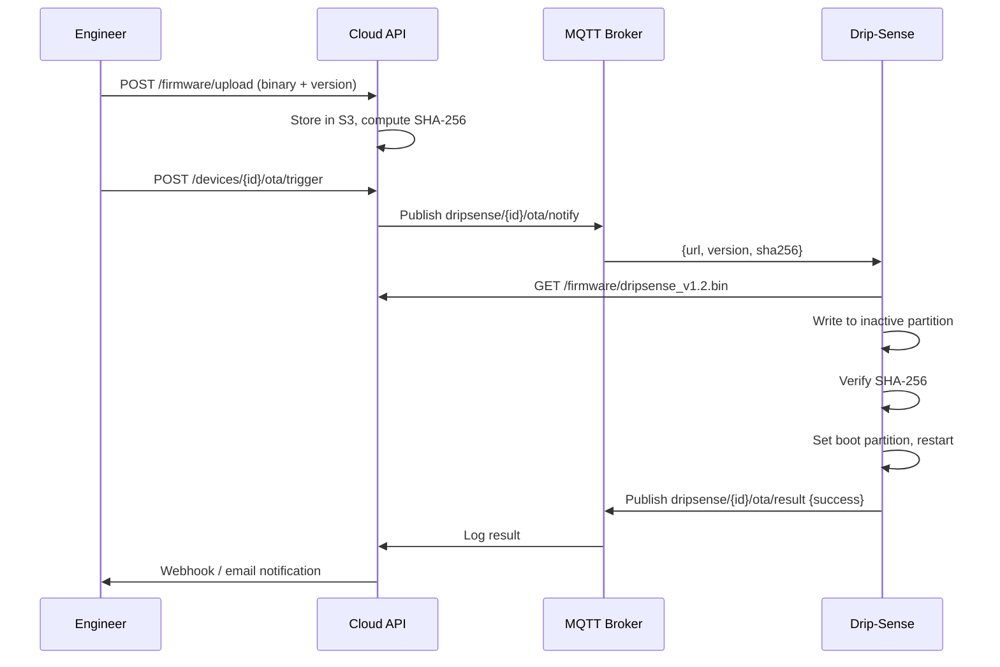

# Drip-Sense — Firmware Deployment Guide

> **Version:** 1.0  
> **Date:** 2026-02-19  
> **Audience:** Firmware engineers, hospital IT/biomedical staff

---

## 1. Development Environment Setup

### 1.1 Prerequisites

| Software | Version | Purpose |
|---|---|---|
| **PlatformIO Core** | ≥ 6.x | Build system & package manager |
| **VSCode** | Latest | IDE with PlatformIO extension |
| **Python** | ≥ 3.8 | PlatformIO dependency |
| **Git** | ≥ 2.x | Source control |
| **USB-UART driver** | CP2102 / CH340 | Serial communication with ESP32 |

### 1.2 Quick Install

```bash
# Install PlatformIO CLI
pip install platformio

# Clone the repository
git clone https://github.com/your-org/drip-sense.git
cd drip-sense

# Install dependencies (auto-fetched on first build)
pio pkg install
```

### 1.3 Arduino IDE Alternative

If using Arduino IDE instead of PlatformIO:

1. Open **Preferences** → Add to *Additional Board Manager URLs*:
   ```
   https://dl.espressif.com/dl/package_esp32_index.json
   ```
2. **Board Manager** → Install "ESP32 by Espressif Systems" (v2.x)
3. Select board: **ESP32 Dev Module**
4. Install required libraries via Library Manager:
   - `HX711` by Bogdan Necula
   - `Adafruit SSD1306`
   - `Adafruit GFX Library`
   - `ESP32Servo`
   - `PubSubClient` (MQTT)
   - `ArduinoJson`

---

## 2. Build Configuration

### 2.1 PlatformIO Configuration (`platformio.ini`)

```ini
[env:esp32dev]
platform = espressif32@6.x
board = esp32dev
framework = arduino
monitor_speed = 115200

; Partition table for dual OTA
board_build.partitions = partitions.csv

; Build flags
build_flags =
    -DCORE_DEBUG_LEVEL=3           ; 0=none, 3=info, 5=verbose
    -DMQTT_MAX_PACKET_SIZE=1024
    -DARDUINOJSON_ENABLE_PROGMEM=0

; Library dependencies
lib_deps =
    bogde/HX711@^0.7.5
    adafruit/Adafruit SSD1306@^2.5.7
    adafruit/Adafruit GFX Library@^1.11.5
    madhephaestus/ESP32Servo@^1.1.1
    knolleary/PubSubClient@^2.8
    bblanchon/ArduinoJson@^6.21.0

; Upload settings
upload_port = /dev/cu.SLAB_USBtoUART    ; macOS
; upload_port = COM3                      ; Windows
upload_speed = 921600

; OTA settings (for wireless deployment)
; upload_protocol = espota
; upload_port = 192.168.1.105
; upload_flags = --auth=ota_password

[env:native]
platform = native
test_framework = unity
build_flags = -std=c++17
```

### 2.2 Custom Partition Table (`partitions.csv`)

```csv
# Name,    Type, SubType, Offset,   Size,    Flags
nvs,       data, nvs,     0x9000,   0x6000,
otadata,   data, ota,     0xF000,   0x2000,
app0,      app,  ota_0,   0x10000,  0x180000,
app1,      app,  ota_1,   0x190000, 0x180000,
spiffs,    data, spiffs,  0x310000, 0xF0000,
```

---

## 3. Serial Flashing (USB)

### 3.1 First-Time Flash

```bash
# Build the firmware
pio run -e esp32dev

# Flash to device (auto-detects port)
pio run -e esp32dev -t upload

# Monitor serial output
pio device monitor -b 115200
```

### 3.2 Manual Flash with esptool

For bare-metal flashing or recovery:

```bash
# Install esptool
pip install esptool

# Erase flash completely (factory fresh)
esptool.py --chip esp32 --port /dev/cu.SLAB_USBtoUART erase_flash

# Flash bootloader + partition table + firmware
esptool.py --chip esp32 --port /dev/cu.SLAB_USBtoUART \
    --baud 921600 \
    write_flash \
    0x1000  .pio/build/esp32dev/bootloader.bin \
    0x8000  .pio/build/esp32dev/partitions.bin \
    0x10000 .pio/build/esp32dev/firmware.bin
```

### 3.3 Entering Flash Mode

If the ESP32 doesn't enter flash mode automatically:
1. Hold the **BOOT** button on the ESP32 dev board
2. Press and release the **EN** (reset) button
3. Release the **BOOT** button
4. The board is now in download mode — run the flash command

---

## 4. Over-the-Air (OTA) Updates

### 4.1 OTA via PlatformIO (Development)

```bash
# Ensure device is on same network
# Uncomment OTA settings in platformio.ini

pio run -e esp32dev -t upload --upload-port 192.168.1.105
```

### 4.2 OTA via Cloud (Production)



### 4.3 OTA Payload Format

```json
{
    "version": "1.2.0",
    "url": "https://ota.dripsense.io/firmware/dripsense_v1.2.0.bin",
    "sha256": "a1b2c3d4e5f6...64char...hex",
    "release_notes": "Fix: flow rate accuracy improvement",
    "min_battery_pct": 50,
    "force": false
}
```

### 4.4 Rollback Procedure

If the new firmware is faulty:

**Automatic rollback:**
- ESP-IDF boot counter detects 3 consecutive crashes within 60 seconds
- Bootloader switches to the previous OTA partition
- Device publishes `ota/result: {status: "rolled_back"}`

**Manual rollback:**
1. Connect via serial
2. Run: `AT+OTA_ROLLBACK`
3. Device reboots to previous partition

**Emergency recovery (serial flash):**
1. Connect via USB
2. Run `esptool.py erase_flash`
3. Flash known-good firmware binary

---

## 5. Version Management

### 5.1 Semantic Versioning

```
MAJOR.MINOR.PATCH
  │     │     └── Bug fixes, no API/behavior changes
  │     └──────── New features, backward-compatible
  └────────────── Breaking changes, hardware rev changes
```

### 5.2 Version in Firmware

```c
// include/version.h
#define FW_VERSION_MAJOR  1
#define FW_VERSION_MINOR  2
#define FW_VERSION_PATCH  0
#define FW_VERSION_STRING "1.2.0"
#define FW_BUILD_DATE     __DATE__
#define FW_BUILD_TIME     __TIME__
```

### 5.3 Release Checklist

| Step | Action | Owner |
|---|---|---|
| 1 | All unit tests pass (`pio test -e native`) | Developer |
| 2 | Integration tests pass on hardware | Developer |
| 3 | Version string updated in `version.h` | Developer |
| 4 | Changelog updated | Developer |
| 5 | Git tag created (`git tag -a v1.2.0 -m "Release 1.2.0"`) | Developer |
| 6 | Binary built in release mode (`build_type = release`) | CI/CD |
| 7 | SHA-256 checksum generated | CI/CD |
| 8 | Binary uploaded to OTA server | CI/CD |
| 9 | Staged rollout: 1 device → ward → hospital | Biomedical engineer |
| 10 | Monitor telemetry for 24h post-deploy | Engineering team |

---

## 6. Build Variants

| Variant | Build Flag | Description |
|---|---|---|
| `DEBUG` | `-DCORE_DEBUG_LEVEL=5` | Verbose serial logging, assertions enabled |
| `RELEASE` | `-DCORE_DEBUG_LEVEL=0` | No serial output, optimizations enabled |
| `TEST` | `-DUNIT_TEST=1` | Stubs HAL, runs on native platform |
| `FACTORY` | `-DFACTORY_MODE=1` | Enables factory test menu, calibration shortcuts |

```bash
# Build debug variant
pio run -e esp32dev --build-flag="-DCORE_DEBUG_LEVEL=5"

# Build release variant
pio run -e esp32dev --build-flag="-DCORE_DEBUG_LEVEL=0" --build-flag="-Os"
```

---

## 7. Troubleshooting Build Issues

| Issue | Cause | Solution |
|---|---|---|
| `fatal error: HX711.h: No such file` | Missing library | Run `pio pkg install` |
| `A fatal error occurred: Failed to connect to ESP32` | Not in flash mode | Hold BOOT, press EN, release BOOT |
| `esptool.py: error: argument --port: expected one argument` | Wrong port | Check `ls /dev/cu.*` and update `upload_port` |
| `Sketch too large` (>1.5 MB) | Firmware exceeds partition size | Enable `-Os` optimization or reduce SPIFFS |
| `Brownout detector was triggered` | Insufficient USB power | Use a powered USB hub or dedicated 5V supply |
| `rst:0xc (SW_CPU_RESET)` after OTA | Firmware crash loop | Connect serial, run `esptool.py erase_otadata` to reset boot partition |

---

> **Previous:** [← Testing & Validation](testing.md)  
> **Next:** [Troubleshooting →](troubleshooting.md)
