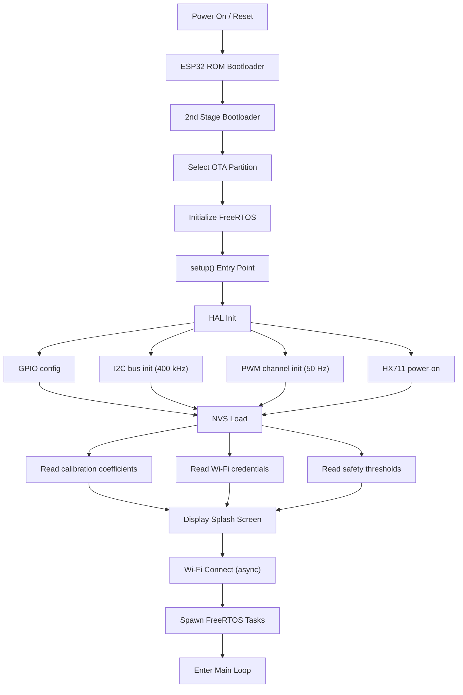
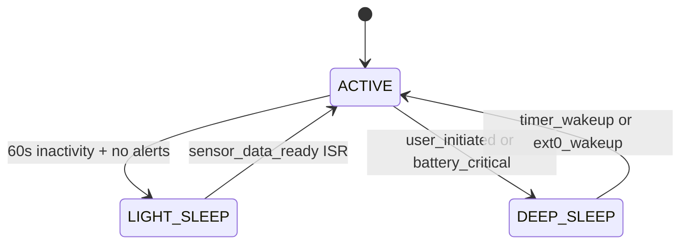
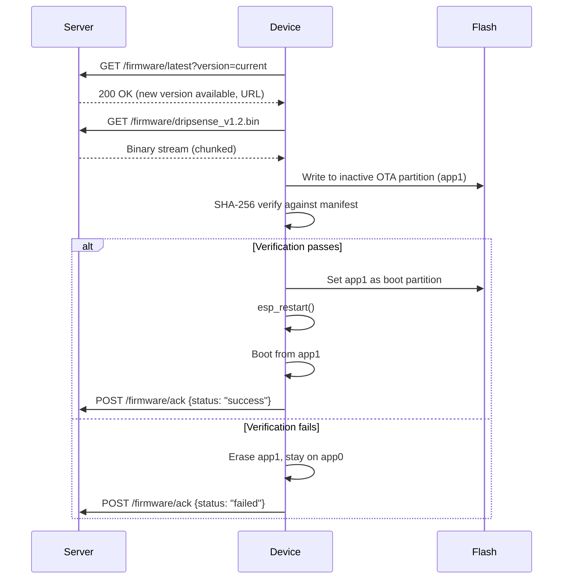

# Drip-Sense — Firmware Design

> **Version:** 1.0  
> **Date:** 2026-02-19  
> **Platform:** ESP32 (ESP-IDF / Arduino Core)

---

## 1. Firmware Overview

The Drip-Sense firmware is a multi-tasking embedded application that runs on the ESP32's dual-core Xtensa LX6 processor. It is built on top of FreeRTOS (bundled with ESP-IDF) and uses a cooperative task model where safety-critical operations are isolated on Core 1 and all network/UI tasks run on Core 0.

### Build Environment

| Parameter | Value |
|---|---|
| **Framework** | Arduino Core for ESP32 (v2.x) / ESP-IDF 5.x |
| **IDE** | PlatformIO (VSCode) or Arduino IDE 2.x |
| **Compiler** | xtensa-esp32-elf-gcc |
| **Flash layout** | Dual OTA partitions (1.5 MB × 2) + NVS + SPIFFS |
| **Debug interface** | USB-UART (CP2102) @ 115200 baud |

---

## 2. Boot Sequence



### Boot Timing Budget

| Stage | Duration | Notes |
|---|---|---|
| ROM + 2nd stage bootloader | ~300 ms | Fixed by silicon |
| FreeRTOS init | ~50 ms | Kernel + idle tasks |
| HAL initialization | ~100 ms | GPIO, I2C, PWM setup |
| NVS read | ~20 ms | 3 namespaces, ~10 keys |
| OLED splash screen | ~50 ms | Logo + version string |
| Wi-Fi association | 1–5 s | Async, non-blocking |
| HX711 stabilization | ~500 ms | First 5 readings discarded |
| **Total to operational** | **~1–6 s** | Sensor ready in ~1s; Wi-Fi may lag |

---

## 3. Main Loop Architecture

After `setup()` completes, the firmware enters the FreeRTOS scheduler. There is no traditional `loop()` — all work is performed by dedicated tasks.

```c
// Pseudo-code: Task creation in setup()
void setup() {
    hal_init();
    nvs_load_config();
    oled_show_splash();
    wifi_connect_async();

    // Core 1 — Safety-critical tasks
    xTaskCreatePinnedToCore(task_sensor_read,   "sensor",  4096, NULL, 5, NULL, 1);
    xTaskCreatePinnedToCore(task_safety_check,   "safety",  2048, NULL, 5, NULL, 1);

    // Core 0 — Network & UI tasks
    xTaskCreatePinnedToCore(task_oled_update,    "oled",    4096, NULL, 3, NULL, 0);
    xTaskCreatePinnedToCore(task_mqtt_publish,   "mqtt",    8192, NULL, 2, NULL, 0);
    xTaskCreatePinnedToCore(task_buzzer_control, "buzzer",  1024, NULL, 3, NULL, 0);
}
```

### Task Priority Map

| Priority | Task | Justification |
|---|---|---|
| 5 (highest) | `task_sensor_read` | Must maintain 10 Hz cadence |
| 5 | `task_safety_check` | Must respond within 100 ms of threshold breach |
| 3 | `task_oled_update` | User-visible, but not safety-critical |
| 3 | `task_buzzer_control` | Alert signaling |
| 2 | `task_mqtt_publish` | Network delays acceptable |
| 1 | `task_ota_update` | Background, on-demand only |
| 0 | FreeRTOS IDLE | Housekeeping, watchdog feed |

---

## 4. Peripheral Driver Design

### 4.1 HX711 ADC Driver

The HX711 uses a proprietary bit-bang protocol (not SPI/I2C). Data is clocked out MSB-first in 24 pulses on DOUT, triggered by SCK.

```c
// hw_hx711.h — Driver API
typedef struct {
    gpio_num_t pin_sck;    // GPIO 18
    gpio_num_t pin_dout;   // GPIO 19
    int32_t    offset;     // Zero-point offset (from calibration)
    float      scale;      // Grams-per-unit factor
} hx711_config_t;

void     hx711_init(hx711_config_t *cfg);
bool     hx711_is_ready(void);           // DOUT == LOW means data ready
int32_t  hx711_read_raw(void);           // Blocking: reads 24-bit value
float    hx711_read_grams(void);         // Applies offset + scale
void     hx711_set_gain(uint8_t gain);   // 128 (ch A), 64 (ch A), 32 (ch B)
void     hx711_tare(uint16_t samples);   // Average N samples as zero offset
void     hx711_power_down(void);         // SCK HIGH > 60µs
void     hx711_power_up(void);           // SCK LOW pulse
```

**Timing constraints:**
- SCK pulse width: ≥ 1 µs HIGH, ≥ 1 µs LOW
- Data ready to read: DOUT goes LOW → must read within 100 ms
- Power-down: SCK held HIGH > 60 µs → HX711 enters sleep

### 4.2 SSD1306 OLED Driver

Uses the Adafruit SSD1306 library or a lightweight custom driver over I2C.

```c
// hw_oled.h — Driver API
void oled_init(uint8_t sda, uint8_t scl, uint8_t addr);  // 0x3C default
void oled_clear(void);
void oled_set_cursor(uint8_t x, uint8_t y);
void oled_print(const char *text, uint8_t size);
void oled_draw_icon(uint8_t x, uint8_t y, const uint8_t *bitmap, uint8_t w, uint8_t h);
void oled_draw_progress_bar(uint8_t x, uint8_t y, uint8_t w, uint8_t h, uint8_t percent);
void oled_display(void);       // Flush frame buffer to display
void oled_set_brightness(uint8_t level);  // 0–255
void oled_sleep(bool enable);  // Display ON/OFF for power saving
```

### 4.3 Servo PWM Driver

Standard 50 Hz PWM with 1–2 ms pulse width mapping to 0°–180°.

```c
// hw_servo.h — Driver API
void servo_init(gpio_num_t pin, uint8_t channel);  // LEDC channel
void servo_set_angle(uint8_t angle);                // 0–180 degrees
void servo_clamp(void);    // Move to CLAMP_ANGLE (configurable)
void servo_release(void);  // Move to OPEN_ANGLE (configurable)
void servo_detach(void);   // Stop PWM to reduce power/noise
```

**PWM configuration:**
- Timer: LEDC timer 0, 50 Hz
- Resolution: 16-bit (65,536 steps)
- Duty for 0°: `(1ms / 20ms) × 65536 ≈ 3277`
- Duty for 180°: `(2ms / 20ms) × 65536 ≈ 6554`

### 4.4 Buzzer Driver

Simple GPIO toggle with pattern support via FreeRTOS software timer.

```c
// hw_buzzer.h — Driver API
typedef enum {
    BUZZ_PATTERN_SINGLE,       // 100ms ON
    BUZZ_PATTERN_DOUBLE,       // 100ms ON, 100ms OFF, 100ms ON
    BUZZ_PATTERN_INTERMITTENT, // 200ms ON, 800ms OFF (repeating)
    BUZZ_PATTERN_CONTINUOUS,   // Continuous ON
    BUZZ_PATTERN_OFF
} buzzer_pattern_t;

void buzzer_init(gpio_num_t pin);
void buzzer_play(buzzer_pattern_t pattern);
void buzzer_stop(void);
```

---

## 5. Interrupt Handling

| Interrupt Source | Type | Pin | Handler |
|---|---|---|---|
| HX711 DOUT falling edge | GPIO ISR | GPIO 19 | Sets `xSemaphore_data_ready` |
| Manual override button | GPIO ISR | GPIO 4 | Debounce → sets `xFlag_manual_override` |
| Watchdog timer | Hardware | — | System reset if not fed within 5s |
| Wi-Fi events | Software | — | `wifi_event_handler()` callback |

### ISR Design Rules

1. **No blocking calls** in ISR — only set semaphores/flags
2. **Minimal execution time** — ISR body < 10 µs
3. **Deferred processing** — ISR wakes a FreeRTOS task via `xSemaphoreGiveFromISR()`
4. **Button debounce** — 50 ms software debounce in ISR using `millis()` comparison

---

## 6. Power Management

### Operating Modes



| Mode | CPU | Wi-Fi | Sensors | Current | Use Case |
|---|---|---|---|---|---|
| **Active** | Both cores @ 240 MHz | ON | Sampling | ~150 mA | Normal monitoring |
| **Light Sleep** | Paused, wakes on ISR | Maintained | Sampling (reduced rate) | ~20 mA | Idle, no alerts |
| **Deep Sleep** | OFF | OFF | OFF | ~10 µA | Standby / transport |

### Power-Down Sequence

1. Complete any in-progress MQTT publish
2. Send `STATUS: GOING_OFFLINE` message
3. Clamp servo to safe position
4. Power down HX711 (SCK HIGH > 60 µs)
5. Turn off OLED display
6. Configure wake-up source (timer or button)
7. Enter `esp_deep_sleep_start()`

---

## 7. OTA Update Mechanism



**Safety guardrails:**
- OTA only allowed when device is in `MONITORING` state (not during active alarm)
- Download uses HTTPS with certificate pinning
- Rollback: if new firmware crashes 3× within 60s, bootloader reverts to previous partition
- Minimum battery level: > 50% (future with battery backup)

---

## 8. File / Module Structure

```
drip_sense/
├── src/
│   ├── main.cpp                 # Entry point: setup() + task creation
│   ├── config.h                 # Pin definitions, constants, defaults
│   │
│   ├── hal/                     # Hardware Abstraction Layer
│   │   ├── hw_hx711.h / .cpp    # Load cell ADC driver
│   │   ├── hw_oled.h / .cpp     # SSD1306 display driver
│   │   ├── hw_servo.h / .cpp    # Servo PWM driver
│   │   └── hw_buzzer.h / .cpp   # Buzzer pattern driver
│   │
│   ├── middleware/               # Business logic & services
│   │   ├── sensor_fusion.h / .cpp   # Filter pipeline (EMA/Kalman)
│   │   ├── safety_ctrl.h / .cpp     # Threshold evaluation & servo actuation
│   │   ├── state_machine.h / .cpp   # System state transitions
│   │   ├── event_bus.h / .cpp       # Pub/sub event dispatcher
│   │   └── config_mgr.h / .cpp     # NVS read/write wrapper
│   │
│   ├── app/                     # Application-level orchestration
│   │   ├── monitor.h / .cpp     # Monitoring engine task
│   │   ├── ui_mgr.h / .cpp      # OLED + buzzer coordination
│   │   └── telemetry.h / .cpp   # MQTT publish logic
│   │
│   └── net/                     # Network services
│       ├── wifi_mgr.h / .cpp    # Wi-Fi connection management
│       ├── mqtt_client.h / .cpp # MQTT wrapper
│       ├── ble_prov.h / .cpp    # BLE Wi-Fi provisioning
│       └── ota_mgr.h / .cpp     # OTA update handler
│
├── include/                     # Shared headers
│   └── version.h                # Firmware version macros
│
├── data/                        # SPIFFS data files
│   └── splash.bmp               # Boot splash screen bitmap
│
├── platformio.ini               # PlatformIO build config
└── partitions.csv               # Custom partition table
```

---

## 9. Configuration Header (`config.h`)

```c
#ifndef CONFIG_H
#define CONFIG_H

// === Pin Definitions ===
#define PIN_HX711_SCK     18
#define PIN_HX711_DOUT    19
#define PIN_OLED_SDA      21
#define PIN_OLED_SCL      22
#define PIN_SERVO         13
#define PIN_BUZZER        15
#define PIN_BUTTON        4

// === Sensor Settings ===
#define HX711_GAIN        128       // Channel A, gain 128
#define HX711_SAMPLE_RATE 10        // Hz
#define EMA_ALPHA         0.3f      // Smoothing factor
#define TARE_SAMPLES      20        // Samples for zero-point average

// === Safety Thresholds ===
#define LOW_FLUID_THRESHOLD_G   10.0f   // Grams
#define FREE_FLOW_MULTIPLIER    1.5f    // × expected rate
#define FLOW_STALL_TIMEOUT_MS   30000   // 30 seconds
#define SERVO_CLAMP_ANGLE       90      // Degrees
#define SERVO_OPEN_ANGLE        0       // Degrees

// === Display ===
#define OLED_ADDR         0x3C
#define OLED_WIDTH        128
#define OLED_HEIGHT       64
#define SCREEN_SAVER_MS   60000     // Dim after 60s

// === Network ===
#define MQTT_BROKER       "mqtt.dripsense.io"
#define MQTT_PORT         8883
#define MQTT_PUB_INTERVAL 5000      // ms
#define WIFI_RETRY_MAX    10
#define WIFI_RETRY_DELAY  5000      // ms

// === OTA ===
#define OTA_SERVER_URL    "https://ota.dripsense.io/firmware"
#define OTA_CHECK_INTERVAL 3600000  // 1 hour

// === Watchdog ===
#define WDT_TIMEOUT_S     5

#endif // CONFIG_H
```

---

> **Previous:** [← Software Architecture](architecture.md)  
> **Next:** [Core Algorithms →](algorithms.md)
