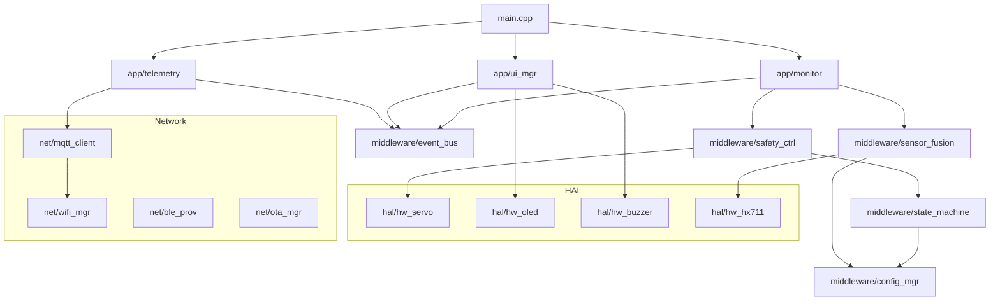

# Drip-Sense — Project Folder Structure

> **Version:** 1.0  
> **Date:** 2026-02-19  
> **Language:** C++ (`.cpp` / `.h`)  
> **Build System:** PlatformIO (ESP-IDF + Arduino Core)

---

## Complete Directory Tree

```
drip-sense/
│
├── 📁 src/                                  # ── All source code ──
│   │
│   ├── main.cpp                             # Application entry point
│   │                                        #   - setup(): HAL init, NVS load, task creation
│   │                                        #   - FreeRTOS scheduler starts (no loop())
│   │
│   ├── config.h                             # Global configuration header
│   │                                        #   - GPIO pin definitions (HX711, OLED, servo, buzzer, button)
│   │                                        #   - Sensor settings (sample rate, EMA alpha, tare samples)
│   │                                        #   - Safety thresholds (low fluid, free-flow, stall timeout)
│   │                                        #   - Network settings (MQTT broker, Wi-Fi retry, OTA URL)
│   │                                        #   - Display settings (OLED addr, dimensions, screensaver)
│   │                                        #   - Watchdog timeout
│   │
│   ├── 📁 hal/                              # ── Hardware Abstraction Layer ──
│   │   │
│   │   ├── hw_hx711.h                       # HX711 ADC driver — header
│   │   │                                    #   - hx711_config_t struct (pin_sck, pin_dout, offset, scale)
│   │   │                                    #   - Function declarations: init, read_raw, read_grams, tare, power_down
│   │   ├── hw_hx711.cpp                     # HX711 ADC driver — implementation
│   │   │                                    #   - Bit-bang protocol: 24 clock pulses on SCK, read DOUT
│   │   │                                    #   - hx711_init(): configure GPIO 18 (SCK) and GPIO 19 (DOUT)
│   │   │                                    #   - hx711_is_ready(): check DOUT LOW for data ready
│   │   │                                    #   - hx711_read_raw(): read 24-bit signed value (MSB first)
│   │   │                                    #   - hx711_read_grams(): apply (raw - offset) / scale_factor
│   │   │                                    #   - hx711_tare(): average N samples → store as zero_offset
│   │   │                                    #   - hx711_set_gain(): set 128/64/32 via extra clock pulses
│   │   │                                    #   - hx711_power_down(): SCK HIGH > 60µs
│   │   │                                    #   - hx711_power_up(): SCK LOW pulse
│   │   │
│   │   ├── hw_oled.h                        # SSD1306 OLED display driver — header
│   │   │                                    #   - Function declarations: init, clear, print, draw_icon,
│   │   │                                    #     draw_progress_bar, display, set_brightness, sleep
│   │   ├── hw_oled.cpp                      # SSD1306 OLED display driver — implementation
│   │   │                                    #   - oled_init(): I2C bus setup on GPIO 21 (SDA) / 22 (SCL)
│   │   │                                    #     at 400 kHz, address 0x3C
│   │   │                                    #   - oled_clear(): zero out 1 KB frame buffer
│   │   │                                    #   - oled_set_cursor(): position text cursor (x, y)
│   │   │                                    #   - oled_print(): render text with font size (1× or 2×)
│   │   │                                    #   - oled_draw_icon(): blit bitmap sprite at (x, y)
│   │   │                                    #   - oled_draw_progress_bar(): filled rect for fluid level %
│   │   │                                    #   - oled_display(): flush frame buffer to SSD1306 over I2C
│   │   │                                    #   - oled_set_brightness(): send contrast command (0–255)
│   │   │                                    #   - oled_sleep(): display ON/OFF for power saving
│   │   │
│   │   ├── hw_servo.h                       # Servo motor PWM driver — header
│   │   │                                    #   - Function declarations: init, set_angle, clamp, release, detach
│   │   ├── hw_servo.cpp                     # Servo motor PWM driver — implementation
│   │   │                                    #   - servo_init(): LEDC timer 0 at 50 Hz, 16-bit resolution
│   │   │                                    #     on GPIO 13
│   │   │                                    #   - servo_set_angle(): map 0°–180° → 1000–2000 µs duty
│   │   │                                    #   - servo_clamp(): move to SERVO_CLAMP_ANGLE (default 90°)
│   │   │                                    #   - servo_release(): move to SERVO_OPEN_ANGLE (default 0°)
│   │   │                                    #   - servo_detach(): stop PWM to eliminate jitter & save power
│   │   │                                    #   - servo_smooth_clamp(): graduated step movement over time
│   │   │
│   │   ├── hw_buzzer.h                      # Piezo buzzer driver — header
│   │   │                                    #   - buzzer_pattern_t enum: SINGLE, DOUBLE, INTERMITTENT,
│   │   │                                    #     CONTINUOUS, OFF
│   │   │                                    #   - Function declarations: init, play, stop
│   │   └── hw_buzzer.cpp                    # Piezo buzzer driver — implementation
│   │                                        #   - buzzer_init(): GPIO 15 as OUTPUT
│   │                                        #   - buzzer_play(): start FreeRTOS software timer for pattern
│   │                                        #   - buzzer_stop(): cancel timer, GPIO LOW
│   │                                        #   - _buzzer_timer_cb(): internal timer callback for patterns
│   │
│   ├── 📁 middleware/                       # ── Business Logic & Services ──
│   │   │
│   │   ├── sensor_fusion.h                  # Signal processing pipeline — header
│   │   │                                    #   - ema_filter_t struct (alpha, last_value, initialized)
│   │   │                                    #   - kalman_1d_t struct (x_est, P, Q, R, K)
│   │   │                                    #   - flow_calc_t struct (ring buffer, index, full flag)
│   │   │                                    #   - Function declarations: ema_init, ema_update, kalman_init,
│   │   │                                    #     kalman_update, flow_calc_update
│   │   ├── sensor_fusion.cpp                # Signal processing pipeline — implementation
│   │   │                                    #   - ema_init(): set alpha, clear initialized flag
│   │   │                                    #   - ema_update(): y = α·x + (1−α)·y_prev
│   │   │                                    #   - kalman_init(): set Q, R, initial P=1.0
│   │   │                                    #   - kalman_update(): predict → update cycle
│   │   │                                    #   - flow_calc_update(): sliding window Δweight/Δtime
│   │   │                                    #     convert g/s → mL/min using fluid density
│   │   │
│   │   ├── safety_ctrl.h                    # Safety controller — header
│   │   │                                    #   - freeflow_detector_t struct
│   │   │                                    #   - Function declarations: detect_low_fluid, detect_free_flow,
│   │   │                                    #     detect_flow_stall, evaluate_safety
│   │   ├── safety_ctrl.cpp                  # Safety controller — implementation
│   │   │                                    #   - detect_low_fluid(): weight < threshold with 3-sample debounce
│   │   │                                    #   - detect_free_flow(): rate > expected×multiplier with 5-sample debounce
│   │   │                                    #   - detect_flow_stall(): Δweight < 0.5g for timeout period
│   │   │                                    #   - evaluate_safety(): master function calling all detectors,
│   │   │                                    #     returns safety_event_t enum
│   │   │
│   │   ├── state_machine.h                  # System state manager — header
│   │   │                                    #   - system_state_t enum: IDLE, CALIBRATING, MONITORING,
│   │   │                                    #     LOW_FLUID, FREE_FLOW, AIR_DETECT, CLAMPED, ERROR, OTA_UPDATE
│   │   │                                    #   - Function declarations: state_init, state_transition,
│   │   │                                    #     state_get_current, state_get_name
│   │   ├── state_machine.cpp                # System state manager — implementation
│   │   │                                    #   - state_init(): set initial state to IDLE
│   │   │                                    #   - state_transition(): validate allowed transitions, log changes
│   │   │                                    #   - state_get_current(): return current state enum
│   │   │                                    #   - state_get_name(): return state as human-readable string
│   │   │
│   │   ├── event_bus.h                      # Event publish/subscribe system — header
│   │   │                                    #   - event_type_t enum: WEIGHT_UPDATE, FLOW_UPDATE, ALARM,
│   │   │                                    #     STATE_CHANGE, WIFI_STATUS, BUTTON_PRESS
│   │   │                                    #   - event_data_t union (weight_g, flow_rate, alarm_type, etc.)
│   │   │                                    #   - event_callback_t function pointer type
│   │   │                                    #   - Function declarations: event_bus_init, subscribe, publish
│   │   ├── event_bus.cpp                    # Event publish/subscribe system — implementation
│   │   │                                    #   - event_bus_init(): clear subscriber list
│   │   │                                    #   - subscribe(): register callback for event type (max 8 per type)
│   │   │                                    #   - publish(): iterate registered callbacks, invoke with event data
│   │   │                                    #   - Uses FreeRTOS queue for thread-safe cross-core delivery
│   │   │
│   │   ├── config_mgr.h                     # NVS configuration manager — header
│   │   │                                    #   - Function declarations: config_init, config_load, config_save,
│   │   │                                    #     config_get_float, config_set_float, config_get_string,
│   │   │                                    #     config_set_string, config_factory_reset
│   │   └── config_mgr.cpp                   # NVS configuration manager — implementation
│   │                                        #   - config_init(): open NVS flash, create namespaces (cal, net, dev, safety)
│   │                                        #   - config_load(): read all stored params into runtime struct
│   │                                        #   - config_save(): write modified params back to NVS
│   │                                        #   - config_get/set_float/string(): typed accessors with defaults
│   │                                        #   - config_factory_reset(): erase all namespaces, reboot
│   │
│   ├── 📁 app/                              # ── Application-Level Orchestration ──
│   │   │
│   │   ├── monitor.h                        # Monitoring engine task — header
│   │   │                                    #   - Function declarations: monitor_task (FreeRTOS entry),
│   │   │                                    #     monitor_get_weight, monitor_get_flow_rate,
│   │   │                                    #     monitor_get_time_to_empty
│   │   ├── monitor.cpp                      # Monitoring engine task — implementation
│   │   │                                    #   - monitor_task(): pinned to Core 1, runs at 10 Hz
│   │   │                                    #     1. Wait for HX711 data ready semaphore
│   │   │                                    #     2. Read raw ADC → calibrate → filter (EMA)
│   │   │                                    #     3. Update flow rate (sliding window)
│   │   │                                    #     4. Compute time-to-empty
│   │   │                                    #     5. Publish WEIGHT_UPDATE and FLOW_UPDATE events
│   │   │                                    #   - monitor_get_weight(): return latest filtered weight
│   │   │                                    #   - monitor_get_flow_rate(): return latest flow rate
│   │   │                                    #   - monitor_get_time_to_empty(): return ETA in minutes
│   │   │
│   │   ├── ui_mgr.h                         # UI manager (OLED + Buzzer) — header
│   │   │                                    #   - Function declarations: ui_task, ui_show_splash,
│   │   │                                    #     ui_show_calibration, ui_show_alarm
│   │   ├── ui_mgr.cpp                       # UI manager (OLED + Buzzer) — implementation
│   │   │                                    #   - ui_task(): pinned to Core 0, runs at 2 Hz (500 ms)
│   │   │                                    #     1. Subscribe to WEIGHT_UPDATE, ALARM, STATE_CHANGE events
│   │   │                                    #     2. Compose OLED frame: status bar + weight + flow + ETA
│   │   │                                    #     3. Draw Wi-Fi icon based on RSSI
│   │   │                                    #     4. Flush to display
│   │   │                                    #   - ui_show_splash(): logo + version for 2s on boot
│   │   │                                    #   - ui_show_calibration(): step-by-step calibration UI
│   │   │                                    #   - ui_show_alarm(): flashing alarm screen + buzzer pattern
│   │   │
│   │   ├── telemetry.h                      # MQTT telemetry publisher — header
│   │   │                                    #   - Function declarations: telemetry_task,
│   │   │                                    #     telemetry_publish_immediate
│   │   └── telemetry.cpp                    # MQTT telemetry publisher — implementation
│   │                                        #   - telemetry_task(): pinned to Core 0, interval = 5s
│   │                                        #     1. Collect latest sensor data from monitor module
│   │                                        #     2. Build JSON payload (ArduinoJson)
│   │                                        #     3. Publish to dripsense/{device_id}/telemetry (QoS 0)
│   │                                        #   - telemetry_publish_immediate(): for alerts (QoS 1)
│   │                                        #     triggered by event bus ALARM subscription
│   │
│   └── 📁 net/                              # ── Network Services ──
│       │
│       ├── wifi_mgr.h                       # Wi-Fi connection manager — header
│       │                                    #   - Function declarations: wifi_init, wifi_connect,
│       │                                    #     wifi_disconnect, wifi_get_rssi, wifi_get_ip,
│       │                                    #     wifi_is_connected, wifi_scan
│       ├── wifi_mgr.cpp                     # Wi-Fi connection manager — implementation
│       │                                    #   - wifi_init(): initialize ESP32 Wi-Fi in STA mode
│       │                                    #   - wifi_connect(): non-blocking connect with retry logic
│       │                                    #     (exponential backoff, max WIFI_RETRY_MAX attempts)
│       │                                    #   - wifi_disconnect(): clean disconnection
│       │                                    #   - wifi_event_handler(): handle STA_CONNECTED, GOT_IP,
│       │                                    #     DISCONNECTED events → publish to event bus
│       │                                    #   - wifi_get_rssi(): return current signal strength (dBm)
│       │                                    #   - wifi_scan(): scan for nearby APs, return SSID list
│       │
│       ├── mqtt_client.h                    # MQTT client wrapper — header
│       │                                    #   - Function declarations: mqtt_init, mqtt_connect,
│       │                                    #     mqtt_publish, mqtt_subscribe, mqtt_is_connected
│       ├── mqtt_client.cpp                  # MQTT client wrapper — implementation
│       │                                    #   - mqtt_init(): set broker URL, port 8883, TLS cert
│       │                                    #   - mqtt_connect(): connect to broker with device_id + token
│       │                                    #   - mqtt_publish(): publish payload to topic with QoS level
│       │                                    #   - mqtt_subscribe(): subscribe to config/set and ota/notify topics
│       │                                    #   - mqtt_callback(): handle incoming messages (config push, OTA trigger)
│       │                                    #   - mqtt_is_connected(): return connection status
│       │
│       ├── ble_prov.h                       # BLE Wi-Fi provisioning — header
│       │                                    #   - Function declarations: ble_prov_init, ble_prov_start,
│       │                                    #     ble_prov_stop, ble_prov_is_active
│       ├── ble_prov.cpp                     # BLE Wi-Fi provisioning — implementation
│       │                                    #   - ble_prov_init(): set up GATT server with provisioning service
│       │                                    #   - ble_prov_start(): advertise as "DRIPSENSE-XXXX"
│       │                                    #   - Characteristics: SSID (write), Password (write),
│       │                                    #     Command (write: connect/scan), Status (notify)
│       │                                    #   - ble_prov_stop(): stop advertising, free resources
│       │
│       ├── ota_mgr.h                        # OTA update manager — header
│       │                                    #   - Function declarations: ota_init, ota_check,
│       │                                    #     ota_start_update, ota_rollback, ota_get_partition_info
│       └── ota_mgr.cpp                      # OTA update manager — implementation
│                                            #   - ota_init(): register MQTT handler for ota/notify topic
│                                            #   - ota_check(): compare current version with server latest
│                                            #   - ota_start_update(): download binary → write to inactive partition
│                                            #     → SHA-256 verify → set boot partition → restart
│                                            #   - ota_rollback(): switch boot back to previous partition
│                                            #   - ota_get_partition_info(): return active/inactive partition labels
│
├── 📁 include/                              # ── Shared Public Headers ──
│   │
│   └── version.h                            # Firmware version macros
│                                            #   - FW_VERSION_MAJOR, FW_VERSION_MINOR, FW_VERSION_PATCH
│                                            #   - FW_VERSION_STRING (e.g., "1.2.0")
│                                            #   - FW_BUILD_DATE, FW_BUILD_TIME (__DATE__, __TIME__)
│
├── 📁 test/                                 # ── Unit & Integration Tests ──
│   │
│   ├── 📁 test_native/                      # Tests that run on host PC (no hardware)
│   │   ├── test_ema_filter.cpp              # EMA filter: init, convergence, step response, noise rejection
│   │   ├── test_kalman_filter.cpp           # Kalman filter: convergence, Q/R tuning, outlier handling
│   │   ├── test_flow_calc.cpp               # Flow rate: linear drain, no flow, free flow, partial buffer
│   │   ├── test_anomaly_detection.cpp       # Low fluid, free flow, stall, debounce logic
│   │   ├── test_servo_mapping.cpp           # Angle-to-duty conversion: 0°, 90°, 180° boundary values
│   │   ├── test_state_machine.cpp           # State transitions: valid, invalid, edge cases
│   │   ├── test_event_bus.cpp               # Subscribe, publish, multi-subscriber, cross-type isolation
│   │   └── test_config_mgr.cpp              # NVS read/write, defaults, factory reset
│   │
│   └── 📁 test_embedded/                    # Tests that run on ESP32 hardware
│       ├── test_hx711_driver.cpp            # Raw read, tare, gain setting, power cycle
│       ├── test_oled_driver.cpp             # Init, text render, icon draw, brightness
│       ├── test_servo_driver.cpp            # Angle movement, clamp/release, detach
│       ├── test_buzzer_driver.cpp           # Pattern playback, stop, GPIO verify
│       ├── test_wifi_connection.cpp         # Connect, disconnect, reconnect, RSSI
│       ├── test_mqtt_pubsub.cpp             # Publish, subscribe, QoS, reconnection
│       └── test_integration_pipeline.cpp    # Full sensor → filter → safety → servo chain
│
├── 📁 lib/                                  # ── Custom Libraries / Vendored Code ──
│   │
│   ├── 📁 dripsense_common/                 # Shared types and constants
│   │   ├── ds_types.h                       # Common typedefs: weight_reading_t, flow_data_t,
│   │   │                                    #   alarm_event_t, device_status_t
│   │   └── ds_constants.h                   # Physical constants: GRAVITY, WATER_DENSITY,
│   │                                        #   SALINE_DENSITY, standard drip factors
│   │
│   └── 📁 at_command/                       # Serial AT command parser
│       ├── at_parser.h                      # AT command registration and parsing engine
│       └── at_parser.cpp                    # - at_register(): register handler for "AT+CMD"
│                                            # - at_process_line(): tokenize, lookup, invoke handler
│                                            # - Built-in commands: AT+HELP, AT+VERSION, AT+REBOOT
│
├── 📁 data/                                 # ── SPIFFS Filesystem Data ──
│   │
│   ├── splash.bmp                           # Boot splash screen bitmap (128×64, 1-bit)
│   ├── icons.bmp                            # Icon sprite sheet (Wi-Fi bars, lock, warning, battery)
│   └── config_defaults.json                 # Factory default configuration (JSON)
│
├── 📁 docs/                                 # ── Documentation Suite ──
│   │
│   ├── README.md                            # Project overview & documentation index
│   ├── prd.md                               # Product Requirements Document
│   ├── architecture.md                      # Software Architecture
│   ├── firmware_design.md                   # Firmware Design
│   ├── algorithms.md                        # Core Algorithms
│   ├── api_spec.md                          # Cloud API & Data Format
│   ├── calibration.md                       # Calibration & Setup Guide
│   ├── testing.md                           # Testing & Validation Plan
│   ├── deployment.md                        # Firmware Deployment Guide
│   ├── troubleshooting.md                   # Troubleshooting Guide
│   ├── folder_structure.md                  # THIS FILE — Project folder structure
│   ├── implementation_plan.md               # Phase-by-phase implementation plan
│   ├── setup.md                             # Setup guide
│   └── guide.md                             # Full project guide
│
├── 📁 hardware/                             # ── Hardware Design Files ──
│   │
│   ├── 📁 schematic/                        # KiCad / EasyEDA schematic files
│   │   ├── dripsense_schematic.kicad_sch    # Main schematic
│   │   └── dripsense_schematic.pdf          # Exported PDF for review
│   │
│   ├── 📁 pcb/                              # PCB layout files
│   │   ├── dripsense_pcb.kicad_pcb          # 4-layer PCB layout
│   │   ├── gerber/                          # Manufacturing Gerber files
│   │   └── bom.csv                          # Bill of Materials
│   │
│   └── 📁 enclosure/                        # 3D-printed case
│       ├── case_top.stl                     # Top shell with OLED window
│       ├── case_bottom.stl                  # Bottom shell with mounting clamp
│       └── servo_bracket.stl                # Servo-to-tube clamp adapter
│
├── 📁 scripts/                              # ── Build & Utility Scripts ──
│   │
│   ├── calibrate.py                         # Serial-based calibration automation
│   ├── provision_wifi.py                    # BLE Wi-Fi provisioning script
│   ├── ota_deploy.py                        # OTA firmware deployment to single/batch devices
│   ├── generate_certs.sh                    # Generate TLS client certificates for MQTT
│   └── flash_factory.sh                     # Full factory flash (erase + bootloader + firmware)
│
├── 📁 tools/                                # ── Development Tools ──
│   │
│   ├── serial_monitor.py                    # Enhanced serial monitor with AT command shortcuts
│   ├── mqtt_dashboard.py                    # CLI dashboard for MQTT telemetry visualization
│   └── crash_decoder.py                     # ESP32 backtrace decoder (addr2line wrapper)
│
├── 📁 ci/                                   # ── CI/CD Pipeline Configs ──
│   │
│   ├── .github/
│   │   └── workflows/
│   │       ├── build.yml                    # Compile check on every push
│   │       ├── test.yml                     # Run unit tests (native) on every push
│   │       └── release.yml                  # Build release binary + deploy to OTA server on tag
│   │
│   └── Dockerfile                           # Docker image for reproducible CI builds
│
├── platformio.ini                           # PlatformIO project configuration
│                                            #   - [env:esp32dev]: target board, framework, libs, upload settings
│                                            #   - [env:native]: host-based unit test environment
│                                            #   - Partition table reference, build flags, serial monitor speed
│
├── partitions.csv                           # Custom ESP32 flash partition table
│                                            #   - nvs (24 KB), otadata (8 KB), app0 (1.5 MB),
│                                            #     app1 (1.5 MB), spiffs (960 KB)
│
├── .gitignore                               # Ignore .pio/, build/, *.o, *.elf, credentials
├── .clang-format                            # Code style: LLVM-based, 4-space indent, 100-col line length
├── LICENSE                                  # MIT License
└── CHANGELOG.md                             # Version history and release notes
```

---

## File Count Summary

| Directory | `.h` Files | `.cpp` Files | Other | Total |
|---|---|---|---|---|
| `src/hal/` | 4 | 4 | — | 8 |
| `src/middleware/` | 5 | 5 | — | 10 |
| `src/app/` | 3 | 3 | — | 6 |
| `src/net/` | 4 | 4 | — | 8 |
| `src/` (root) | 1 (`config.h`) | 1 (`main.cpp`) | — | 2 |
| `include/` | 1 | — | — | 1 |
| `test/` | — | 15 | — | 15 |
| `lib/` | 3 | 1 | — | 4 |
| **Total source** | **21** | **33** | — | **54** |
| `docs/` | — | — | 14 `.md` | 14 |
| `data/` | — | — | 3 | 3 |
| `hardware/` | — | — | ~8 | ~8 |
| `scripts/` | — | — | 5 | 5 |
| `tools/` | — | — | 3 | 3 |
| `ci/` | — | — | 4 | 4 |
| Root files | — | — | 5 | 5 |
| **Grand total** | | | | **~96** |

---

## Module Dependency Graph



---

> **See also:** [Firmware Design](firmware_design.md) for detailed module specifications
