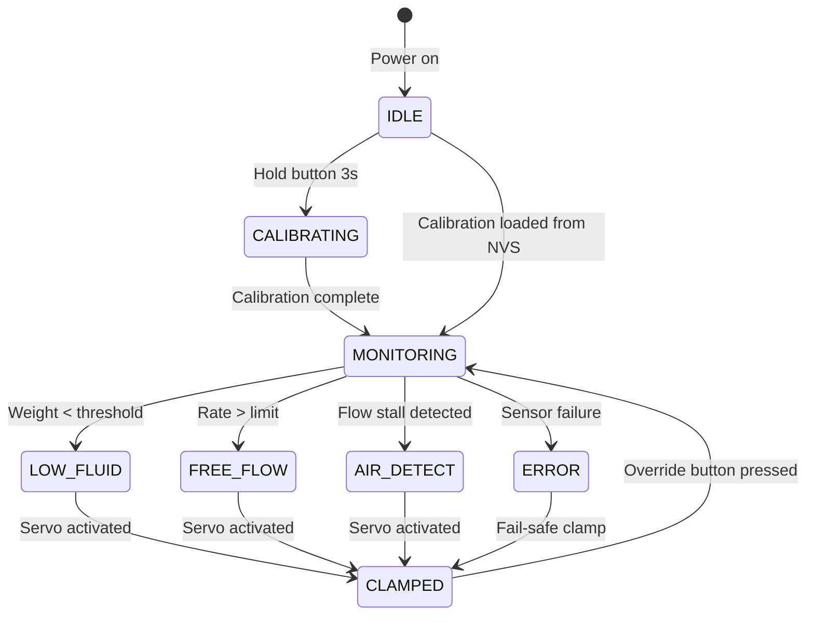
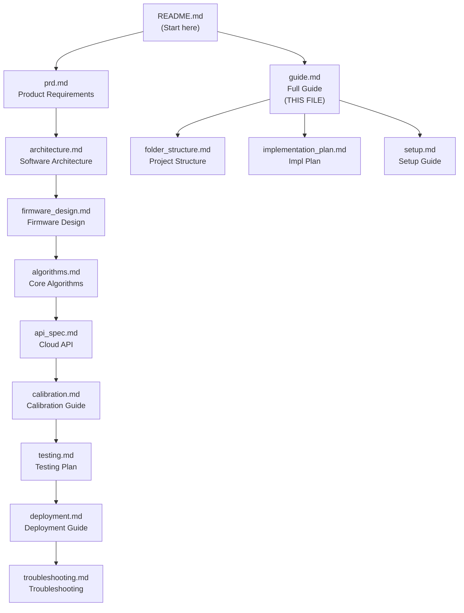

# Drip-Sense — Complete Project Guide

> **Version:** 1.0  
> **Date:** 2026-02-19  
> **Audience:** All stakeholders — developers, biomedical engineers, nursing staff, hospital IT

---

## Table of Contents

1. [What is Drip-Sense?](#1-what-is-drip-sense)
2. [How It Works](#2-how-it-works)
3. [Hardware Components](#3-hardware-components)
4. [Software Architecture](#4-software-architecture)
5. [Getting Started](#5-getting-started)
6. [Daily Operations](#6-daily-operations)
7. [Understanding the Display](#7-understanding-the-display)
8. [Alarms & Safety System](#8-alarms--safety-system)
9. [Cloud Dashboard](#9-cloud-dashboard)
10. [Maintenance & Calibration](#10-maintenance--calibration)
11. [Advanced Configuration](#11-advanced-configuration)
12. [Development Guide](#12-development-guide)
13. [FAQ](#13-faq)
14. [Documentation Map](#14-documentation-map)

---

## 1. What is Drip-Sense?

Drip-Sense is a **low-cost, ESP32-based medical IoT device** that automates IV drip monitoring. It attaches to a standard IV pole and provides:

- **Continuous weight measurement** of the IV bag — no more manual rounds
- **Real-time flow rate** display (mL/min and drops/min)
- **Automatic tube clamping** when the bag runs critically low or a free-flow condition is detected
- **Cloud telemetry** for centralized ward monitoring via a web dashboard
- **Audible and visual alerts** on the bedside unit

### Why Drip-Sense?

| Problem Today | Drip-Sense Solution |
|---|---|
| Nurses check IV bags every 15–30 min | Continuous, automated monitoring |
| Risk of air embolism if bag empties | Auto-clamp triggers before bag is empty |
| Uncontrolled free-flow from loose clamps | Free-flow detected and clamped in < 2s |
| No remote visibility of IV status | Cloud dashboard shows all active IVs |
| Expensive commercial IV pumps (₹50,000+) | Drip-Sense costs ~₹2,800 per unit |

---

## 2. How It Works

```
    IV Bag (hanging from hook)
         │
         │ weight
         ▼
    ┌──────────────┐
    │  Load Cell    │ ──→ Measures bag weight continuously
    │  + HX711 ADC  │     (10 readings per second)
    └──────┬───────┘
           │
           ▼
    ┌──────────────┐
    │  ESP32 Brain  │ ──→ Filters noise, calculates flow rate,
    │  (dual-core)  │     detects anomalies, makes safety decisions
    └──┬──┬──┬──┬──┘
       │  │  │  │
       │  │  │  └──→ 📡 Wi-Fi: sends telemetry to cloud every 5s
       │  │  └─────→ 🔊 Buzzer: sounds alarms when needed
       │  └────────→ 📺 OLED: shows weight, flow rate, ETA
       └───────────→ ⚙️ Servo: clamps IV tube on alarm
```

### The Monitoring Cycle

1. **Measure:** Load cell senses weight → HX711 digitizes at 24-bit resolution
2. **Filter:** EMA filter smooths out vibration noise
3. **Compute:** Flow rate = weight change over time (mL/min)
4. **Evaluate:** Safety checks — is fluid too low? Is flow too fast? Has flow stalled?
5. **Act:** If alarm → clamp tube + sound buzzer + alert cloud
6. **Report:** Display on OLED + publish to MQTT every 5 seconds

---

## 3. Hardware Components

### 3.1 Component Overview

| Component | Role | Key Specs |
|---|---|---|
| **ESP32** | Brain — runs all software | 240 MHz dual-core, Wi-Fi, BLE, 520 KB RAM |
| **Load Cell** | Senses IV bag weight | 5 kg capacity, analog output |
| **HX711** | Converts analog weight to digital | 24-bit ADC, 10/80 Hz |
| **SG90 Servo** | Clamps IV tube on alarm | 1.8 kg·cm torque, 180° range |
| **OLED Display** | Shows real-time data | 128×64 pixels, 0.96", I2C |
| **Buzzer** | Sounds audible alerts | Piezoelectric, active type |
| **Override Button** | Manual alarm acknowledge | Momentary pushbutton |

### 3.2 GPIO Pin Map

| ESP32 Pin | Connected To | Protocol |
|---|---|---|
| GPIO 18 | HX711 Clock (SCK) | Bit-bang |
| GPIO 19 | HX711 Data (DOUT) | Bit-bang |
| GPIO 21 | OLED SDA | I2C |
| GPIO 22 | OLED SCL | I2C |
| GPIO 13 | Servo Signal | PWM (50 Hz) |
| GPIO 15 | Buzzer | Digital OUT |
| GPIO 4 | Override Button | Digital IN (pull-up) |

### 3.3 Power Requirements

| Rail | Voltage | Current | Supplies |
|---|---|---|---|
| USB Input | 5V | ≥ 2A | Everything |
| Logic Rail | 3.3V | ~100 mA | ESP32, HX711, OLED |
| Servo Rail | 5V (isolated) | ~500 mA peak | SG90 servo motor |

> [!IMPORTANT]
> Use a **5V, 2A or higher** USB adapter. Standard 500 mA USB ports will cause brownouts during servo actuation.

---

## 4. Software Architecture

### 4.1 Layered Design

```
┌─────────────────────────────────────────┐
│          APPLICATION LAYER              │
│  Monitor • Safety Ctrl • UI • Telemetry │
├─────────────────────────────────────────┤
│           MIDDLEWARE LAYER              │
│  Sensor Fusion • State Machine • Events │
├─────────────────────────────────────────┤
│   HARDWARE ABSTRACTION LAYER (HAL)     │
│  HX711 • OLED • Servo • Buzzer • Net   │
├─────────────────────────────────────────┤
│            HARDWARE                     │
│  Load Cell • Display • Motor • Piezo    │
└─────────────────────────────────────────┘
```

### 4.2 Dual-Core Task Distribution

| Core | Tasks | Why |
|---|---|---|
| **Core 1** (Real-time) | Sensor reading (10 Hz), safety checks, servo actuation | Safety-critical; must never be blocked by network |
| **Core 0** (Network/UI) | Wi-Fi, MQTT publish, OLED rendering, BLE, OTA | Can tolerate network delays without affecting safety |

### 4.3 System States



---

## 5. Getting Started

### 5.1 Quick Start (5 Minutes)

1. **Plug in** USB-C cable to 5V ≥2A adapter
2. **Wait** for boot (OLED shows logo, then "UNCALIBRATED")
3. **Calibrate:**
   - Hold button 3s →  "CALIBRATION MODE"
   - Empty platform → press button → "TARE COMPLETE"
   - Place 500g weight → press button → "CALIBRATION DONE"
4. **Connect Wi-Fi** (optional): Use BLE app or serial AT commands
5. **Mount** on IV pole, route tube through servo clamp
6. **Hang IV bag** → monitoring starts automatically

### 5.2 Detailed Setup

For step-by-step instructions with wiring diagrams and troubleshooting, see:
- [Setup Guide](setup.md) — Complete environment and hardware setup
- [Calibration Guide](calibration.md) — Detailed calibration procedure
- [Deployment Guide](deployment.md) — Firmware build and flash instructions

---

## 6. Daily Operations

### 6.1 Starting a New IV Session

1. Ensure device is powered and showing "MONITORING" on OLED
2. Verify calibration hasn't expired (check serial: `AT+HX711_SCALE_INFO`)
3. Hang the new IV bag — system detects and starts tracking automatically
4. Wait 10 seconds for flow rate to stabilize
5. Verify OLED shows reasonable weight and flow rate
6. Ensure Wi-Fi is connected (📶 icon on OLED)

### 6.2 Changing IV Bags

1. Close the manual roller clamp first
2. Remove empty bag, hang new bag
3. System will detect the weight change and update automatically
4. Open roller clamp — flow rate should appear within 10 seconds

> [!NOTE]
> After a bag change, the flow rate display may show 0.0 for up to 10 seconds as the sliding window fills with new data. This is normal.

### 6.3 Responding to Alarms

| Alarm Type | Buzzer Sound | OLED Display | What to Do |
|---|---|---|---|
| **Low Fluid** | ●—●—●— (intermittent) | "⚠️ LOW FLUID" + remaining weight | Check bag; replace if needed; press button to acknowledge |
| **Free Flow** | ●●●●●● (continuous) | "🚨 FREE FLOW" + flow rate | Check roller clamp; press button to release servo |
| **Flow Stall** | ●—●—●— (intermittent) | "⚠️ FLOW STALL" | Check for tube kink; verify bag has fluid |
| **Sensor Error** | ●●●●●● (continuous) | "E01: SENSOR FAULT" | Call biomedical engineering |

**To acknowledge an alarm and release the clamp:**
- Press the **override button** once
- Servo releases, buzzer stops, system returns to MONITORING
- If the underlying condition persists, alarm will re-trigger after 30 seconds

### 6.4 Shift Handoff Checklist

| Check | Method |
|---|---|
| Device powered and monitoring | OLED shows weight + flow rate |
| No active alarms | No buzzer; OLED shows normal display |
| Wi-Fi connected | 📶 icon visible on OLED |
| Calibration current | Last calibration < 30 days ago |
| IV bag level adequate | Weight reading > 100g |

---

## 7. Understanding the Display

### 7.1 Main Screen Layout

```
┌────────────────────────────────────┐
│  📶 MONITORING            ●       │  ← Status bar: WiFi + state + indicator
├────────────────────────────────────┤
│                                    │
│      Weight:  487.3 g              │  ← Primary metric (large font)
│      Flow:    2.1 mL/min           │  ← Secondary metric
│                                    │
├────────────────────────────────────┤
│  ETA: 3h 42m      [▓▓▓▓▓▓▓░░░]   │  ← Time remaining + fluid level bar
└────────────────────────────────────┘
```

### 7.2 Display Page Cycling

Press the **override button briefly** to cycle through display pages:

| Page | Content |
|---|---|
| **Page 1** (default) | Weight, flow rate, ETA |
| **Page 2** | Drops/min, drip factor, fluid density |
| **Page 3** | Wi-Fi SSID, IP address, RSSI |
| **Page 4** | Device ID, firmware version, uptime |

### 7.3 Status Icons

| Icon | Meaning |
|---|---|
| 📶 (4 bars) | Wi-Fi excellent (RSSI > -50 dBm) |
| 📶 (2 bars) | Wi-Fi moderate (RSSI -50 to -70 dBm) |
| 📶 (1 bar) | Wi-Fi weak (RSSI < -70 dBm) |
| ✕ | Wi-Fi disconnected |
| 🔒 | Tube clamped (servo engaged) |
| ⚠️ | Active warning or alarm |
| ⚖️ | Calibration mode |

---

## 8. Alarms & Safety System

### 8.1 Safety Philosophy

Drip-Sense operates on a **fail-safe** principle:

- **Any unrecoverable error** → clamp the tube (fail-closed)
- **Sensor failure** → assume danger → clamp immediately
- **Wi-Fi failure** → continue monitoring locally; alerts still work via buzzer + OLED
- **Manual override** always available — the button can release the clamp at any time

### 8.2 Detection Methods

| Anomaly | How Detected | Response Time |
|---|---|---|
| **Low fluid** | Weight drops below configurable threshold (default: 10g) | < 300 ms (3 samples) |
| **Free flow** | Flow rate exceeds 1.5× expected rate | < 500 ms (5 samples) |
| **Flow stall** | Weight stable for 30s while flow was previously active | 30 s |
| **Sensor fault** | HX711 stops producing data for > 1 second | Immediate |

### 8.3 Auto-Learning

During the first 5 minutes of monitoring, Drip-Sense records the median flow rate and uses it as the "expected rate" for free-flow detection. This means:

- No manual configuration of expected flow rate is needed
- The system adapts to the specific IV set and patient prescription
- You can override the auto-learned rate via serial: `AT+EXPECTED_RATE=3.0`

### 8.4 Alarm Escalation

```
t = 0s     Anomaly detected → evaluate debounce
t = 0.3s   Debounce confirmed → CLAMP servo + BUZZER starts
t = 0.5s   OLED display switches to alarm screen
t = 1.0s   MQTT alert published (QoS 1)
t = 1.5s   Cloud dashboard updates, push notification sent

... ALARM CONTINUES until nurse acknowledges ...

Nurse presses OVERRIDE button:
t = N      Buzzer stops → servo releases → state → MONITORING
t = N+30s  If condition persists → alarm re-triggers
```

---

## 9. Cloud Dashboard

### 9.1 Features

| Feature | Description |
|---|---|
| **Ward overview** | All active IV sessions in a ward, color-coded by status |
| **Real-time telemetry** | Weight + flow rate + ETA for each device, updating every 5s |
| **Alert feed** | Chronological list of all alerts with severity and timestamp |
| **Historical charts** | Weight trend, flow rate trend, alarm history per device |
| **Device management** | Register, configure, and OTA-update devices remotely |
| **Nurse notifications** | Push notifications to mobile app on critical alerts |

### 9.2 Alert Color Coding

| Color | Severity | Meaning |
|---|---|---|
| 🟢 Green | Normal | Device monitoring normally |
| 🟡 Yellow | Warning | Low battery, weak Wi-Fi, or minor issue |
| 🔴 Red | Critical | Low fluid, free flow, or air detected — tube clamped |
| ⚫ Gray | Offline | Device not connected to cloud |

### 9.3 Remote Configuration

From the dashboard, you can remotely adjust device parameters:

- Low fluid threshold (grams)
- Free-flow multiplier
- Drip factor (gtt/mL)
- Telemetry publish interval
- Trigger OTA firmware update

Changes are pushed via MQTT and applied within 5 seconds.

---

## 10. Maintenance & Calibration

### 10.1 Maintenance Schedule

| Task | Frequency | Responsibility |
|---|---|---|
| Visual inspection (cables, connectors) | Daily | Nursing staff |
| Weight accuracy spot-check | Weekly | Biomedical engineer |
| Full recalibration | Monthly | Biomedical engineer |
| Firmware update check | Monthly | Hospital IT |
| Servo clamp test | Monthly | Biomedical engineer |
| Clean device exterior | Weekly | Nursing staff |
| Replace IV tube adapter | Every 6 months | Biomedical engineer |

### 10.2 Recalibration Procedure

1. Place device on flat surface
2. Hold button 3s → calibration mode
3. Tare (empty) → button
4. Known weight → button
5. Verify with a different weight
6. Return to IV pole

**Full details:** [Calibration Guide](calibration.md)

### 10.3 Battery / Power

- Current version: USB-powered only (no battery)
- Future upgrade: Li-ion battery backup planned for uninterruptible operation
- If power is lost, the servo holds position via friction — tube remains clamped if it was in clamped state

---

## 11. Advanced Configuration

### 11.1 All Configurable Parameters

| Parameter | Serial Command | Default | Range |
|---|---|---|---|
| EMA alpha | `AT+EMA_ALPHA=0.3` | 0.3 | 0.05–0.9 |
| Low fluid threshold | `AT+LOW_THRESHOLD=10` | 10 g | 5–50 g |
| Free-flow multiplier | `AT+FF_MULTI=1.5` | 1.5× | 1.2–3.0× |
| Stall timeout | `AT+STALL_TIMEOUT=30000` | 30,000 ms | 10,000–120,000 ms |
| Fluid density | `AT+FLUID_DENSITY=1.0` | 1.0 g/mL | 0.9–1.1 |
| Drip factor | `AT+DRIP_FACTOR=20` | 20 gtt/mL | 15, 20, 60 |
| Servo clamp angle | `AT+SERVO_CLAMP_ANGLE=90` | 90° | 60–120° |
| Servo open angle | `AT+SERVO_OPEN_ANGLE=0` | 0° | 0–30° |
| MQTT publish interval | `AT+MQTT_INTERVAL=5000` | 5,000 ms | 1,000–60,000 ms |
| Screen saver timeout | `AT+SCREENSAVER=60000` | 60,000 ms | 0 (disabled)–300,000 ms |

### 11.2 Debug / Diagnostic Commands

| Command | Description |
|---|---|
| `AT+HELP` | List all commands |
| `AT+STATUS` | System state, uptime, heap |
| `AT+HX711_RAW` | Raw 24-bit ADC value |
| `AT+WEIGHT` | Calibrated, filtered weight |
| `AT+FLOW` | Current flow rate |
| `AT+HEAP` | Free/min heap memory |
| `AT+TASKS` | FreeRTOS task stack usage |
| `AT+NVS_DUMP` | All stored configuration |
| `AT+CRASH_LOG` | Last crash backtrace |

### 11.3 Factory Reset

**Via button:** Hold 10 seconds → countdown → reboot  
**Via serial:** `AT+FACTORY_RESET` → type `CONFIRM`

---

## 12. Development Guide

### 12.1 Adding a New Feature

1. **Plan:** Create a feature branch (`git checkout -b feature/my-feature`)
2. **Implement:** Follow the layered architecture — HAL → middleware → app
3. **Test:** Write unit tests in `test/test_native/`; run with `pio test -e native`
4. **Integrate:** Run on hardware; verify with `pio test -e esp32dev`
5. **Review:** Submit PR with clear description
6. **Deploy:** Once merged, CI builds release binary; OTA to target devices

### 12.2 Coding Standards

| Rule | Details |
|---|---|
| Language | C++17 (Arduino Core compatible) |
| Style | LLVM-based, 4-space indent, 100 char line length (`.clang-format`) |
| Naming | `snake_case` for functions/variables; `PascalCase` for types; `UPPER_CASE` for constants |
| Headers | Include guards (`#ifndef`) in all `.h` files |
| Comments | Doxygen-style (`///`) for API functions; inline comments for non-obvious logic |
| Error handling | Return error codes (not exceptions); log via `Serial.printf()` |
| Memory | No dynamic allocation in ISRs; prefer stack allocation |

### 12.3 Testing Your Changes

```bash
# Run all unit tests (host PC, no hardware needed)
pio test -e native

# Run specific test file
pio test -e native -f test_ema_filter

# Run on ESP32 hardware (connected via USB)
pio test -e esp32dev

# Build release variant
pio run -e esp32dev --build-flag="-DCORE_DEBUG_LEVEL=0"
```

### 12.4 Project Structure

For the complete file-by-file breakdown of the project structure, see: [Folder Structure](folder_structure.md)

---

## 13. FAQ

### General

**Q: Is Drip-Sense FDA / CE certified?**  
A: No. The current version is a research prototype. Clinical deployment requires ISO 13485, IEC 60601-1, and IEC 62304 certification, which is planned for Phase 3 of the development roadmap.

**Q: What IV fluids are compatible?**  
A: Any fluid with a density close to 1.0 g/mL (saline, dextrose 5%, Ringer's lactate). Fluid density is configurable via `AT+FLUID_DENSITY`. Highly viscous fluids or blood products may need adjusted flow-rate thresholds.

**Q: Can it work without Wi-Fi?**  
A: Yes. All safety features (weight monitoring, anomaly detection, auto-clamp, OLED display, buzzer) work locally without any network connection. Wi-Fi is only needed for cloud telemetry and remote dashboard access.

**Q: How accurate is the weight measurement?**  
A: ±1 gram after proper calibration with a known reference weight, on a stable surface.

**Q: What happens during a power outage?**  
A: If the servo was in clamped position, mechanical friction holds the clamp. If power was lost during monitoring, the device reboots when power returns, loads calibration from NVS, and resumes monitoring within 6 seconds. A future Li-ion battery backup is planned.

### Troubleshooting

**Q: The device keeps rebooting**  
A: Check serial log for "Brownout detector triggered" — use a ≥2A power adapter. If you see crash backtraces, see [Troubleshooting Guide](troubleshooting.md).

**Q: Weight reading is wildly inaccurate**  
A: Recalibrate on a flat surface. If still wrong, check HX711 wiring (GPIO 18/19) and load cell wire color mapping.

**Q: Flow rate always shows 0.0**  
A: Check that the IV valve is open and fluid is actually flowing. Wait 10 seconds after starting flow. If still zero, the EMA filter may be too aggressive — try `AT+EMA_ALPHA=0.5`.

**Q: Servo doesn't clamp the tube completely**  
A: Tube diameter may be different from default. Increase clamp angle: `AT+SERVO_CLAMP_ANGLE=100`.

**Q: Multiple devices interfere with each other**  
A: Each device has a unique `device_id` and publishes to its own MQTT topic. There is no RF interference between devices.

---

## 14. Documentation Map



| Document | Best For |
|---|---|
| [README](README.md) | First-time visitors — project overview |
| [PRD](prd.md) | Stakeholders — understanding what & why |
| [Architecture](architecture.md) | Developers — system design & data flow |
| [Firmware Design](firmware_design.md) | Firmware engineers — module specs & drivers |
| [Algorithms](algorithms.md) | Signal processing — filter & detection logic |
| [API Spec](api_spec.md) | Backend/frontend devs — MQTT & REST schemas |
| [Calibration](calibration.md) | Field technicians — device setup |
| [Testing](testing.md) | QA engineers — test plans & validation |
| [Deployment](deployment.md) | DevOps — build, flash, OTA |
| [Troubleshooting](troubleshooting.md) | All users — problem resolution |
| [Folder Structure](folder_structure.md) | Developers — code navigation |
| [Implementation Plan](implementation_plan.md) | Project managers — timeline & milestones |
| [Setup Guide](setup.md) | New developers — environment setup |
| **This Guide** | Everyone — comprehensive reference |

---

> ⚠️ **Disclaimer:** Drip-Sense is a research prototype. It is not certified for clinical use. Always maintain manual IV monitoring procedures until regulatory certification is complete.
