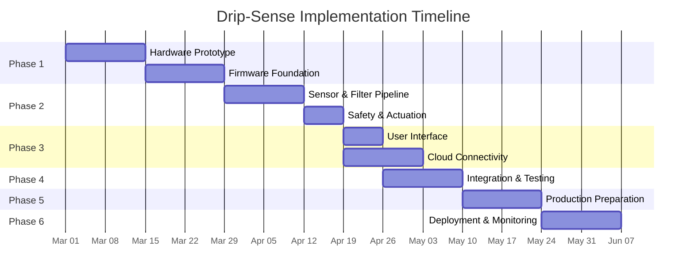

# Drip-Sense — Implementation Plan

> **Version:** 1.0  
> **Date:** 2026-02-19  
> **Status:** Active  
> **Estimated Timeline:** 16 weeks (4 months)

---

## Overview

This document outlines the complete, phase-by-phase implementation plan for the Drip-Sense Autonomous IV Management System — from initial breadboard prototyping through to production-ready hardware. Each phase includes objectives, deliverables, acceptance criteria, risk mitigations, and team responsibilities.

---

## Phase Summary

| Phase | Name | Duration | Key Output |
|---|---|---|---|
| **1** | Hardware Prototype & Firmware Foundation | 4 weeks | Working breadboard + boot sequence |
| **2** | Sensor Pipeline & Safety System | 3 weeks | Accurate weight + auto-clamp |
| **3** | User Interface & Cloud Connectivity | 2 weeks | OLED dashboard + MQTT telemetry |
| **4** | Integration, Testing & Validation | 2 weeks | All subsystems verified end-to-end |
| **5** | Production Preparation | 2 weeks | Custom PCB + enclosure + OTA |
| **6** | Deployment & Field Monitoring | 3 weeks | Pilot deployment + monitoring |

---

## Phase 1: Hardware Prototype & Firmware Foundation

**Duration:** Weeks 1–4  
**Goal:** Assemble hardware on breadboard; establish firmware skeleton with build system and HAL drivers.

### 1.1 Hardware Assembly (Weeks 1–2)

| Task | Details | Acceptance Criteria |
|---|---|---|
| Source all components | ESP32 dev board, load cell + HX711, SG90 servo, OLED module, buzzer, USB-C cable | All components received and verified |
| Breadboard wiring | Wire all components per GPIO pin map (see PRD §6) | Each component responds to basic test code |
| Power rail setup | 5V USB → 3.3V (ESP32 logic) and 5V (servo isolated rail) via buck converters | No brownout on servo actuation |
| Load cell mounting | Create temporary platform for load cell with known weight test | Stable readings with 500g reference weight |
| Servo clamp mechanism | 3D-print initial tube clamp adapter | Tube clamps securely without crushing |

**Risks & Mitigations:**

| Risk | Impact | Mitigation |
|---|---|---|
| Load cell arrives damaged | 1-week delay | Order 2 units; test immediately on receipt |
| Servo draws too much current | Brownout during clamp | Isolate servo power rail; add 470 µF bulk capacitor |
| HX711 module DOA | Cannot start sensor development | Keep spare; validate with Arduino example sketch |

### 1.2 Firmware Foundation (Weeks 3–4)

| Task | Details | Acceptance Criteria |
|---|---|---|
| PlatformIO project setup | Create project with `platformio.ini`, custom `partitions.csv`, `.clang-format` | `pio run` compiles clean with zero warnings |
| `config.h` definitions | All GPIO pins, constants, defaults | Matches hardware wiring exactly |
| `version.h` | Firmware version macros with `__DATE__` and `__TIME__` | Displayed on serial boot and OLED splash |
| HAL: `hw_hx711.cpp` | Bit-bang driver: init, read_raw, read_grams, tare, power cycle | Reads stable raw ADC values; tare zeroes output |
| HAL: `hw_oled.cpp` | I2C driver: init, clear, print, draw_icon, display, brightness | Text renders correctly on 128×64 display |
| HAL: `hw_servo.cpp` | PWM driver: init, set_angle, clamp, release, detach | Servo moves to specified angles accurately |
| HAL: `hw_buzzer.cpp` | GPIO driver: init, pattern play (single, double, intermittent, continuous) | All 4 buzzer patterns audibly distinct |
| `main.cpp` skeleton | `setup()`: HAL init, NVS load, splash screen, task creation stubs | Device boots, shows splash, enters idle loop |
| NVS `config_mgr.cpp` | Read/write calibration, Wi-Fi creds, safety thresholds | Persists across reboot; factory reset erases all |

**Deliverables:**
- ✅ Working breadboard with all 5 peripherals connected
- ✅ PlatformIO project compiles and uploads
- ✅ Each HAL driver passes standalone test
- ✅ Device boots and displays firmware version on OLED

---

## Phase 2: Sensor Pipeline & Safety System

**Duration:** Weeks 5–7  
**Goal:** Build the real-time signal processing pipeline and safety controller with automatic servo actuation.

### 2.1 Sensor Fusion Pipeline (Weeks 5–6)

| Task | Details | Acceptance Criteria |
|---|---|---|
| `sensor_fusion.cpp` — EMA filter | Implement `ema_init()`, `ema_update()` with configurable alpha | Noise reduced by ≥ 60% at default α=0.3 |
| `sensor_fusion.cpp` — Kalman filter | Implement 1D Kalman with configurable Q, R | Converges within 20 samples on constant signal |
| `sensor_fusion.cpp` — Flow rate calc | Sliding window `flow_calc_update()` with ring buffer | Accuracy within ±10% of known pump rate |
| Time-to-empty estimation | `current_weight / (flow_rate × density)` | Matches manual calculation within ±5 min |
| Unit tests: filters | T-EMA-01 through T-EMA-06; T-KAL-01 through T-KAL-04 | All pass on `pio test -e native` |
| Unit tests: flow calc | T-FLOW-01 through T-FLOW-05 | All pass |
| Calibration procedure | Two-point calibration: tare + known weight via button | Accuracy ±1g with 500g reference |

**Key Design Decisions:**

| Decision | Rationale |
|---|---|
| EMA as primary filter (not Kalman) | Lower computational cost; sufficient for most hospital environments |
| Kalman as optional second stage | Enabled via NVS flag for high-vibration environments (mobile carts) |
| 1-second flow window (10 samples) | Balances responsiveness vs. noise; shorter windows are too noisy |
| Fluid density = 1.0 g/mL default | Saline and most IV fluids ≈ 1.0; configurable for dextrose (1.05) |

### 2.2 Safety Controller (Week 7)

| Task | Details | Acceptance Criteria |
|---|---|---|
| `safety_ctrl.cpp` — Low fluid detection | weight < threshold with 3-sample debounce | Triggers reliably; no false positives from vibration |
| `safety_ctrl.cpp` — Free-flow detection | rate > expected × multiplier with 5-sample debounce | Detects within 500ms of onset |
| `safety_ctrl.cpp` — Flow stall detection | Δweight < 0.5g for configurable timeout | Triggers at exactly timeout duration |
| `safety_ctrl.cpp` — Sensor fault | HX711 data-ready timeout > 1s | Immediate clamp + alarm |
| `state_machine.cpp` | IDLE → CALIBRATING → MONITORING → {LOW_FLUID, FREE_FLOW, AIR_DETECT} → CLAMPED | Valid transitions work; invalid ones are rejected |
| `event_bus.cpp` | Pub/sub with FreeRTOS queue for cross-core events | Events delivered within 10ms across cores |
| `monitor.cpp` task | Core 1 task: read → filter → flow → safety → event publish at 10 Hz | Stable 10 Hz cadence; no deadline misses |
| Servo smooth clamp | Graduated 90-step movement over 1 second | No tube damage; complete occlusion |
| Emergency clamp | Direct 0→90° in < 300ms | Stops flow within 2 seconds of threshold breach |
| Unit tests: anomaly detection | T-ANOM-01 through T-ANOM-05 | All pass |

**Deliverables:**
- ✅ Sensor pipeline reads, filters, and computes flow accurately
- ✅ Safety system detects all 4 anomaly types
- ✅ Servo clamps automatically on alarm
- ✅ Manual override button releases clamp
- ✅ All unit tests pass

---

## Phase 3: User Interface & Cloud Connectivity

**Duration:** Weeks 8–9  
**Goal:** Implement OLED dashboard, buzzer patterns, MQTT telemetry, and Wi-Fi/BLE connectivity.

### 3.1 User Interface (Week 8)

| Task | Details | Acceptance Criteria |
|---|---|---|
| `ui_mgr.cpp` — Main display | 4-zone layout: status bar, weight, flow rate, ETA | All values update at 2 Hz, readable at arm's length |
| `ui_mgr.cpp` — Status icons | Wi-Fi bars (RSSI-based), lock (clamped), warning (alarm) | Icons visually distinguish 4+ states |
| `ui_mgr.cpp` — Alarm screen | Flashing display with alarm type and instructions | Highly visible; nurse can read alarm type immediately |
| `ui_mgr.cpp` — Calibration UI | Step-by-step OLED prompts (tare → known weight → done) | User can calibrate without documentation |
| `ui_mgr.cpp` — Splash screen | Logo + version string for 2 seconds on boot | Displays firmware version for field verification |
| `ui_mgr.cpp` — Screen saver | Dim OLED after 60s of no alarms | Display brightness reduces; revives on any event |
| Buzzer integration | Pattern play on: cal complete, low fluid, emergency, Wi-Fi connect | Patterns audibly distinct at 2m distance |
| Button handler | Short press: cycle display pages; Hold 3s: calibrate; Hold 10s: factory reset | All 3 modes work reliably with debounce |

### 3.2 Cloud Connectivity (Weeks 8–9)

| Task | Details | Acceptance Criteria |
|---|---|---|
| `wifi_mgr.cpp` | STA mode connect with WPA2; exponential backoff retry; event handler | Connects within 10s; auto-reconnects on dropout |
| `mqtt_client.cpp` | TLS connection to broker; publish/subscribe; keepalive | Publishes telemetry at 5s intervals; alerts at QoS 1 |
| `telemetry.cpp` — JSON payload | ArduinoJson serialization matching API spec schema | Valid JSON; all fields present; device_id correct |
| `telemetry.cpp` — Alert publishing | Immediate publish on ALARM event from event bus | Alert reaches broker within 500ms of detection |
| `ble_prov.cpp` | GATT server for Wi-Fi provisioning via phone app | SSID/password received; connection established |
| `mqtt_client.cpp` — Config receive | Subscribe to `config/set` topic; apply changes to NVS | Config changes take effect within 5s |
| AT command interface | Serial debug: AT+HELP, AT+STATUS, AT+WIFI_STATUS, AT+MQTT_STATUS, etc. | All 17 commands respond correctly |

**Deliverables:**
- ✅ OLED shows real-time weight, flow, ETA with status icons
- ✅ Buzzer patterns work for all event types
- ✅ MQTT telemetry publishes to cloud broker
- ✅ BLE provisioning configures Wi-Fi successfully
- ✅ Serial AT debug interface functional

---

## Phase 4: Integration, Testing & Validation

**Duration:** Weeks 10–11  
**Goal:** End-to-end integration testing; hardware-in-the-loop validation; safety fault injection.

### 4.1 Integration Testing (Week 10)

| Task | Details | Acceptance Criteria |
|---|---|---|
| Sensor → Display pipeline | Place known weight → verify OLED shows ±1g | T-INT-01 passes |
| Low fluid → Servo chain | Gradually remove weight → clamp triggers | T-INT-02: clamp within 2s |
| Free flow → Alert chain | Rapid weight decrease → clamp + MQTT alert | T-INT-03: alert on broker |
| Manual override | Press button → servo releases, monitoring resumes | T-INT-04 passes |
| Wi-Fi → MQTT flow | Full publish cycle, reconnection after dropout | T-INT-05, T-INT-06 pass |
| NVS persistence | Calibrate → reboot → verify calibration intact | T-INT-07 passes |
| Event bus coverage | Alarm triggers OLED + buzzer + MQTT simultaneously | T-INT-08: all within 500ms |

### 4.2 Hardware-in-the-Loop Testing (Week 10–11)

| Task | Details | Acceptance Criteria |
|---|---|---|
| HIL test bench setup | Peristaltic pump + water reservoir + test PC (pytest) | Automated test harness operational |
| Weight accuracy sweep | 50, 100, 200, 500, 1000g calibrated weights | All within ±1g (T-HIL-01) |
| Flow rate accuracy | Pump at 1, 2, 5, 10 mL/min | Within ±10% of pump rate (T-HIL-02) |
| Auto-clamp on empty | Run bag to empty via pump | Clamp engages at threshold (T-HIL-03) |
| OTA update cycle | Push v1.1 → v1.2 while monitoring active | Update succeeds; monitoring resumes (T-HIL-05) |
| Power cycle recovery | Yank USB, reconnect | Resumes within 6s (T-HIL-07) |

### 4.3 Safety Validation (Week 11)

| Task | Details | Acceptance Criteria |
|---|---|---|
| Fault injection: HX711 disconnect | Pull wire during monitoring | Clamp + alarm within 2s (T-SAFE-01) |
| Fault injection: OLED disconnect | Unplug I2C during monitoring | Monitoring continues; buzzer alerts work (T-SAFE-02) |
| Fault injection: Wi-Fi AP off | Disable AP during monitoring | Local monitoring continues (T-SAFE-04) |
| Fault injection: NVS corrupt | Erase NVS externally | Boots with defaults; prompts recal (T-SAFE-05) |
| 72-hour soak test | Continuous monitoring with bag changes | No crashes, heap stable, no false alarms (T-SOAK-01) |
| Environmental: temperature | 10°C and 45°C chambers | Weight drift < 2g (T-ENV-01, T-ENV-02) |

**Deliverables:**
- ✅ All integration tests pass (T-INT-01 through T-INT-08)
- ✅ All HIL tests pass (T-HIL-01 through T-HIL-07)
- ✅ All safety validation tests pass (T-SAFE-01 through T-SAFE-08)
- ✅ 72-hour soak test completed without failures
- ✅ Test report generated (JUnit XML)

---

## Phase 5: Production Preparation

**Duration:** Weeks 12–13  
**Goal:** Transition from breadboard to custom PCB; finalize enclosure; implement OTA infrastructure.

### 5.1 Custom PCB Design (Week 12)

| Task | Details | Acceptance Criteria |
|---|---|---|
| Schematic capture | KiCad/EasyEDA: ESP32 + HX711 + OLED header + servo connector + buzzer + power | Schematic review passed by 2 engineers |
| PCB layout | 4-layer stack-up: signals/GND/power/signals | DRC clean; signal integrity verified |
| Power plane design | Isolated servo power rail; decoupling caps on every IC VCC | No servo noise on ADC readings |
| EMI considerations | Ground pour, ferrite beads on sensitive lines | Pre-compliance scan within limits |
| Gerber generation | Manufacturing files for PCB fabrication | Files verified by fab house (JLCPCB / PCBWay) |
| BOM finalization | Full BOM with supplier part numbers and costs | Total ≤ ₹2,800 per unit at qty 10 |

### 5.2 Enclosure & Mechanical (Week 12)

| Task | Details | Acceptance Criteria |
|---|---|---|
| 3D-printed case design | Top shell (OLED window, button hole) + Bottom (mounting clamp, USB port) | PCB fits; OLED aligns with window; button accessible |
| Servo bracket | Clamp adapter for standard IV tube sizes (4.0–5.0 mm OD) | Secure grip; no tube damage; easy insertion |
| IP rating assessment | Evaluate splash resistance (target: IPX1 drip-proof) | Water drip from above does not enter enclosure |
| Label design | Model number, serial number, compliance marks, QR code for docs | Durable label; QR links to online docs |

### 5.3 OTA Infrastructure (Week 13)

| Task | Details | Acceptance Criteria |
|---|---|---|
| `ota_mgr.cpp` | MQTT-triggered OTA: download → verify SHA-256 → swap partition → reboot | Firmware updates successfully over Wi-Fi |
| OTA server setup | S3 bucket + API endpoint for firmware upload and version check | Firmware binary served over HTTPS |
| Rollback mechanism | Auto-rollback after 3 crashes within 60s | Device recovers to previous version automatically |
| Staged rollout support | API: deploy to single device → ward → hospital | Each stage verified before proceeding |

### 5.4 CI/CD Pipeline (Week 13)

| Task | Details | Acceptance Criteria |
|---|---|---|
| GitHub Actions: build | Compile check on every push | Green badge on README |
| GitHub Actions: test | Run `pio test -e native` on every push | All unit tests pass in CI |
| GitHub Actions: release | On git tag: build release binary → upload to OTA server | Binary available for OTA within 10 min of tag |
| Docker build environment | Reproducible CI container with toolchain | Same binary produced locally and in CI |

**Deliverables:**
- ✅ Custom 4-layer PCB fabricated and assembled
- ✅ 3D-printed enclosure manufactured
- ✅ OTA update system tested end-to-end
- ✅ CI/CD pipeline operational

---

## Phase 6: Deployment & Field Monitoring

**Duration:** Weeks 14–16  
**Goal:** Pilot deployment in controlled hospital environment; field monitoring; documentation finalization.

### 6.1 Pilot Deployment (Week 14)

| Task | Details | Acceptance Criteria |
|---|---|---|
| Site survey | Verify hospital Wi-Fi coverage at target ward; identify power outlets | RSSI > -70 dBm at all bed positions |
| Device provisioning | Flash production firmware; calibrate; provision Wi-Fi | Each unit operational and publishing telemetry |
| Staff training | 30-min session: mounting, calibration, alarm response, override button | Nurses can independently set up a device |
| Deploy 5 units | Install on 5 IV stands in one ward | All 5 publishing telemetry to cloud dashboard |

### 6.2 Field Monitoring (Weeks 15–16)

| Task | Details | Acceptance Criteria |
|---|---|---|
| Telemetry monitoring | Monitor cloud dashboard for anomalies, gaps, false alarms | < 1 false alarm per device per 24 hours |
| Uptime tracking | Verify > 99.5% uptime over 14 days | Cloud logs confirm |
| Nurse feedback | Collect feedback via Likert-scale survey | > 80% approval rating |
| Bug triage | Collect crash logs, OTA-push fixes as needed | Zero critical bugs at end of pilot |
| Weight accuracy audit | Spot-check 3 devices with calibrated weights | All within ±1g |

### 6.3 Documentation Finalization (Week 16)

| Task | Details |
|---|---|
| Update all docs with pilot learnings | Revise calibration, troubleshooting, and deployment guides |
| Create training video script | 5-minute walkthrough for nursing staff onboarding |
| Publish docs to GitHub Pages | Hosted documentation site with search |
| Archive pilot data | Export telemetry and alert data for analysis |

**Deliverables:**
- ✅ 5 units deployed and operating for 14 days
- ✅ Nurse satisfaction survey > 80% approval
- ✅ Zero critical bugs at pilot end
- ✅ Complete documentation suite published

---

## Resource Requirements

### Team

| Role | Count | Responsibilities |
|---|---|---|
| Firmware Engineer | 2 | HAL drivers, middleware, application tasks |
| Hardware Engineer | 1 | PCB design, power management, EMI |
| Cloud/Backend Engineer | 1 | MQTT broker, REST API, dashboard |
| Mechanical Engineer | 1 (part-time) | Enclosure design, 3D printing |
| Biomedical Engineer | 1 (part-time) | Clinical requirements, field deployment |
| QA Engineer | 1 | Testing, validation, safety certification prep |

### Equipment

| Item | Quantity | Purpose |
|---|---|---|
| ESP32 dev boards | 10 | Development + 5 pilot units |
| Load cell + HX711 | 12 | Development (2) + pilot (5) + spares (5) |
| SG90 servos | 12 | Same distribution |
| Calibrated weights | 1 set | 50g, 100g, 200g, 500g, 1000g |
| Peristaltic pump | 1 | HIL test bench |
| Oscilloscope | 1 | Signal debugging |
| Logic analyzer | 1 | Protocol debugging (I2C, bit-bang) |
| 3D printer | 1 | Enclosure prototyping |

### Budget Estimate

| Category | Cost (INR) | Notes |
|---|---|---|
| Components (12 units) | ₹33,600 | 12 × ₹2,800 |
| PCB fabrication (10 boards) | ₹15,000 | JLCPCB, 4-layer, SMD assembly |
| 3D printing materials | ₹5,000 | PLA/PETG filament |
| Cloud services (1 year) | ₹12,000 | MQTT broker + API hosting |
| Calibrated weights | ₹8,000 | NIST-traceable set |
| Misc tools + shipping | ₹10,000 | Connectors, wire, shipping |
| **Total** | **₹83,600** | ~$1,000 USD |

---

## Risk Register

| ID | Risk | Probability | Impact | Mitigation |
|---|---|---|---|---|
| R-01 | Load cell drift requires frequent recalibration | Medium | Medium | Temperature compensation algorithm (Phase 2 enhancement) |
| R-02 | Servo power noise corrupts HX711 readings | High | High | Isolated power rails + ferrite beads (addressed in Phase 1) |
| R-03 | Hospital Wi-Fi blocks MQTT port 8883 | Medium | Medium | Fallback to WebSocket (port 443) or BLE |
| R-04 | Tube diameter variance across manufacturers | Medium | Low | Adjustable clamp angle via NVS config |
| R-05 | Nurse adoption resistance | Low | High | Intuitive OLED UI; formal training session; feedback loop |
| R-06 | Regulatory delays for clinical certification | High | High | Phase 1–4 focus on research POC; certification is Phase 3 roadmap |
| R-07 | Component supply chain disruption | Low | Medium | Source from 2+ suppliers; keep 5-unit spare inventory |

---

> **See also:** [Setup Guide →](setup.md) for step-by-step environment and hardware setup
