# Drip-Sense — Testing & Validation Plan

> **Version:** 1.0  
> **Date:** 2026-02-19  
> **Scope:** Unit tests, integration tests, HIL testing, safety validation

---

## 1. Testing Strategy Overview

```mermaid
graph TB
    subgraph "Level 1: Unit Tests"
        U1["Filter algorithms (EMA, Kalman)"]
        U2["Flow rate calculation"]
        U3["Anomaly detection logic"]
        U4["NVS config manager"]
        U5["Servo angle-to-duty conversion"]
    end

    subgraph "Level 2: Integration Tests"
        I1["Sensor → Filter → Safety pipeline"]
        I2["Safety → Servo actuation chain"]
        I3["Event bus pub/sub routing"]
        I4["Wi-Fi → MQTT publish flow"]
    end

    subgraph "Level 3: Hardware-in-the-Loop"
        H1["Load cell accuracy bench test"]
        H2["Servo clamp force measurement"]
        H3["End-to-end drip simulation"]
        H4["OTA update cycle"]
    end

    subgraph "Level 4: Safety Validation"
        S1["Fault injection testing"]
        S2["Power failure recovery"]
        S3["72-hour soak test"]
        S4["Environmental stress test"]
    end

    U1 & U2 & U3 & U4 & U5 --> I1 & I2 & I3 & I4
    I1 & I2 & I3 & I4 --> H1 & H2 & H3 & H4
    H1 & H2 & H3 & H4 --> S1 & S2 & S3 & S4
```



---

## 2. Unit Tests

### 2.1 Framework & Tooling

| Tool | Purpose |
|---|---|
| **Unity** (ThrowTheSwitch) | C unit test framework for embedded |
| **PlatformIO Test Runner** | Automated test execution on host (native) and target (ESP32) |
| **CMock** | Mock generation for HAL drivers |

### 2.2 Test Cases

#### EMA Filter Tests

| Test ID | Description | Input | Expected Output | Pass Criteria |
|---|---|---|---|---|
| T-EMA-01 | First sample initialization | `x=100.0, α=0.3` | `y=100.0` | Exact match |
| T-EMA-02 | Steady-state convergence | 10× `x=500.0` | `y→500.0` | `|y-500| < 0.1` |
| T-EMA-03 | Step response | `x=0→1000` | Settling in ~9 samples | `y > 950` by sample 9 |
| T-EMA-04 | Noise rejection | `x=500 ± random(50)` | `σ(y) < σ(x)` | Variance reduced by ≥60% |
| T-EMA-05 | Alpha boundary (0.0) | `α=0.0` | `y = initial` always | No change |
| T-EMA-06 | Alpha boundary (1.0) | `α=1.0` | `y = x` always | No filtering |

#### Kalman Filter Tests

| Test ID | Description | Pass Criteria |
|---|---|---|
| T-KAL-01 | Convergence on constant signal | `|estimate - true| < 0.1` after 20 samples |
| T-KAL-02 | Step response tracking | Settles within 15 samples |
| T-KAL-03 | Q/R ratio sensitivity | Higher Q → faster tracking, more noise |
| T-KAL-04 | Outlier resilience | Single 10× spike attenuated by ≥80% |

#### Flow Rate Calculation Tests

| Test ID | Description | Input | Expected Output |
|---|---|---|---|
| T-FLOW-01 | Linear drainage (2 mL/min) | Weight decreasing by 0.2 g per sample (10 Hz) | `2.0 ±0.1 mL/min` |
| T-FLOW-02 | No flow (constant weight) | Stable weight over 10 samples | `0.0 mL/min` |
| T-FLOW-03 | Free flow (rapid drainage) | Weight decreasing by 1.0 g per sample | `10.0 ±0.5 mL/min` |
| T-FLOW-04 | Partial buffer (< window size) | First 5 samples | `0.0 mL/min` (insufficient data) |
| T-FLOW-05 | Negative flow (refill bag) | Weight increasing | `0.0 mL/min` (clamped to zero) |

#### Anomaly Detection Tests

| Test ID | Description | Input | Expected |
|---|---|---|---|
| T-ANOM-01 | Low fluid triggers alarm | `weight = 9.5 g, threshold = 10.0 g` | `true` after 3 consecutive |
| T-ANOM-02 | Low fluid debounce prevents false positive | `weight = 9.5, 11.0, 9.5 g` (alternating) | `false` (not 3 consecutive) |
| T-ANOM-03 | Free flow detection | `rate = 4.0, expected = 2.0, multiplier = 1.5` | `true` after 5 consecutive |
| T-ANOM-04 | Flow stall detection | `Δweight < 0.5 g` for `>30s` | `true` |
| T-ANOM-05 | Sensor fault (HX711 timeout) | No data ready for 1.1 s | `true` (immediate) |

#### Servo Control Tests

| Test ID | Description | Pass Criteria |
|---|---|---|
| T-SERVO-01 | Angle-to-duty mapping: 0° | Duty = 3,277 (1 ms / 20 ms × 65536) |
| T-SERVO-02 | Angle-to-duty mapping: 180° | Duty = 6,554 (2 ms / 20 ms × 65536) |
| T-SERVO-03 | Smooth clamp profile | 90 steps over 1 second, each 11 ms apart |
| T-SERVO-04 | Emergency clamp speed | Completes in < 300 ms |

---

## 3. Integration Tests

### 3.1 Test Environment

Integration tests run on the ESP32 hardware with real peripherals connected, using PlatformIO's `test_transport = serial` mode.

### 3.2 Test Cases

| Test ID | Scenario | Procedure | Pass Criteria |
|---|---|---|---|
| T-INT-01 | **Sensor → Filter → Display** | Place known weight, verify OLED shows correct value | Displayed weight within ±1 g |
| T-INT-02 | **Low fluid → Servo clamp** | Gradually remove weight until < 10 g | Servo clamps within 2 s; buzzer sounds |
| T-INT-03 | **Free flow → Servo clamp** | Rapidly remove weight (simulate free flow) | Servo clamps; alert published to MQTT |
| T-INT-04 | **Manual override release** | Press button during CLAMPED state | Servo releases; state → MONITORING |
| T-INT-05 | **Wi-Fi → MQTT telemetry** | Connect to network, verify broker receives | JSON payload matches schema; interval ±500 ms |
| T-INT-06 | **Wi-Fi disconnect → recovery** | Disable AP, wait, re-enable | Auto-reconnect within 30 s; telemetry resumes |
| T-INT-07 | **NVS persistence** | Calibrate, reboot, verify calibration loaded | Weight reading matches pre-reboot ±0.5 g |
| T-INT-08 | **Event bus routing** | Trigger alarm, verify OLED + buzzer + MQTT all respond | All three outputs activated within 500 ms |

---

## 4. Hardware-in-the-Loop (HIL) Testing

### 4.1 Test Bench Setup

```
┌──────────────────────────────────────────────────┐
│                    HIL TEST BENCH                │
│                                                  │
│  ┌──────────┐     ┌───────────┐                  │
│  │ Water    │────►│ Peristaltic│──── IV Tube ──►  │
│  │ Reservoir│     │ Pump (cal) │      │           │
│  └──────────┘     └───────────┘      │           │
│                                       ▼           │
│                               ┌──────────────┐   │
│                               │  Drip-Sense  │   │
│                               │    Unit       │   │
│                               └──────┬───────┘   │
│                                      │            │
│  ┌──────────┐     ┌───────────┐      │           │
│  │ USB-UART │◄───│ Test PC    │◄─────┘           │
│  │ Logger   │     │ (pytest)  │    serial log     │
│  └──────────┘     └───────────┘                  │
└──────────────────────────────────────────────────┘
```

### 4.2 HIL Test Cases

| Test ID | Scenario | Setup | Pass Criteria | Duration |
|---|---|---|---|---|
| T-HIL-01 | **Weight accuracy sweep** | Place 50, 100, 200, 500, 1000 g calibrated weights | All readings within ±1 g | 15 min |
| T-HIL-02 | **Flow rate accuracy** | Peristaltic pump at 1, 2, 5, 10 mL/min | Displayed flow within ±10% | 30 min |
| T-HIL-03 | **Auto-clamp on empty** | Run pump until bag empties | Clamp engages at threshold; no air enters line | 45 min |
| T-HIL-04 | **Free-flow simulation** | Open pump to max flow | Detection + clamp within 2 s | 5 min |
| T-HIL-05 | **OTA update cycle** | Push firmware v1.1 → v1.2 while monitoring | Update completes; monitoring resumes; config preserved | 10 min |
| T-HIL-06 | **OTA rollback** | Push corrupted firmware | Device auto-reverts to previous version within 3 reboots | 5 min |
| T-HIL-07 | **Power cycle recovery** | Yank USB during monitoring, reconnect | Boot, reload NVS, resume monitoring within 6 s | 2 min |

---

## 5. Safety Validation Matrix

### 5.1 Fault Injection Tests

| Test ID | Fault Injected | Expected System Response | Severity |
|---|---|---|---|
| T-SAFE-01 | HX711 disconnected (wire pulled) | Clamp tube, sound alarm, enter ERROR state | 🔴 Critical |
| T-SAFE-02 | OLED disconnected | Continue monitoring; log I2C error; buzzer alerts work | 🟡 Warning |
| T-SAFE-03 | Servo disconnected | Alarm sounds; MQTT alert published; manual clamp needed | 🔴 Critical |
| T-SAFE-04 | Wi-Fi AP powered off | Local monitoring continues; telemetry queued; BLE fallback | 🟡 Warning |
| T-SAFE-05 | NVS corrupted (erased) | Boot with compiled defaults; prompt recalibration | 🟡 Warning |
| T-SAFE-06 | Heap exhaustion (memory leak) | Watchdog reset; log crash dump; resume monitoring | 🔴 Critical |
| T-SAFE-07 | Firmware crash (hard fault) | Watchdog reset within 5 s; boot to last good partition | 🔴 Critical |
| T-SAFE-08 | Buzzer stuck on (GPIO fault) | Timeout after 30 s; log error | 🟢 Info |

### 5.2 Environmental Stress Tests

| Test ID | Condition | Duration | Pass Criteria |
|---|---|---|---|
| T-ENV-01 | 10°C cold room | 4 hours | Weight drift < 2 g; no boot failures |
| T-ENV-02 | 45°C hot room | 4 hours | Weight drift < 2 g; no thermal shutdown |
| T-ENV-03 | High humidity (80% RH) | 8 hours | No condensation failures; stable readings |
| T-ENV-04 | Vibration (simulated transport) | 30 min | Filtered weight stable within ±3 g |

### 5.3 Endurance / Soak Test

| Test ID | Scenario | Duration | Pass Criteria |
|---|---|---|---|
| T-SOAK-01 | Continuous monitoring with periodic bag changes | 72 hours | No crashes, memory leaks (heap stable ±5%), or false alarms |
| T-SOAK-02 | Wi-Fi reconnection stress | 24 hours (AP cycled every 10 min) | All reconnections succeed within 30 s; no crashes |

---

## 6. Performance Benchmarks

| Metric | Target | Test Method |
|---|---|---|
| Sensor read latency | < 5 ms | `micros()` timing around `hx711_read_raw()` |
| Filter pipeline latency | < 1 ms | `micros()` timing for EMA + flow calc |
| Safety check latency | < 1 ms | `micros()` around threshold evaluation |
| OLED frame render | < 30 ms | `millis()` around full frame draw |
| MQTT publish latency | < 500 ms | Timestamp diff: publish → broker receipt |
| Boot to operational | < 6 s | Stopwatch from power-on to first valid reading |
| Heap usage (steady state) | < 200 KB | `esp_get_free_heap_size()` logged every 60 s |
| Task stack high-water mark | > 20% free | `uxTaskGetStackHighWaterMark()` for each task |

---

## 7. Test Execution & Reporting

### 7.1 Running Unit Tests

```bash
# Run all unit tests on native (host) platform
pio test -e native

# Run on ESP32 hardware (connected via USB)
pio test -e esp32dev

# Run specific test suite
pio test -e native -f test_ema_filter
```

### 7.2 Test Report Format

Each test run generates a report in JUnit XML format:

```xml
<testsuite name="dripsense" tests="42" failures="0" errors="0" time="12.5">
    <testcase name="T-EMA-01" classname="test_ema_filter" time="0.001"/>
    <testcase name="T-EMA-02" classname="test_ema_filter" time="0.003"/>
    ...
</testsuite>
```

### 7.3 CI/CD Integration

| Stage | Tool | Trigger |
|---|---|---|
| Compile check | PlatformIO CI | Every push |
| Unit tests (native) | PlatformIO test (native) | Every push |
| Integration tests (ESP32) | PlatformIO test (esp32dev) | Weekly / pre-release |
| HIL tests | Custom pytest suite | Pre-release |
| Safety validation | Manual + documented checklist | Major release |

---

> **Previous:** [← Calibration & Setup Guide](calibration.md)  
> **Next:** [Firmware Deployment →](deployment.md)
